# 开发方向：岗位输入、有限来源搜索与候选人事实

状态：**可运行的本地工作流，尚非完整产品架构**。本文记录已实现行为、关键不变量与后续讨论方向；界面、材料批准和部署方式仍待决定。

## 工程尺度原则

后续仍按可验收增量推进，但每个增量按实际使用条件设计：真实事实会增长、内容会修改、检索可能误召回或漏召回、外部模型可能失败，个人数据范围必须可解释。不能因为当前样例少就把全部事实复制到每个岗位、跳过 schema 迁移、混合模块责任或让模型结果直接成为业务决定。新增结构需要说明数据量增长后的读取范围、版本失效条件、隐私边界和失败行为；尚未出现的并发、云部署和多用户需求仍不提前建设。

## 当前已实现

`facts.py` 使用本机 SQLite 保存事实文本、分类、标签、版本和独立人工确认，支持从 JSON 批量导入 pending 事实和原子化批量确认，并提供有限候选检索；`job_search.py` 读取 Greenhouse、Lever、Ashby 公开招聘板，用事实库标签在本机排序，选岗后只保存 JD 快照，也接受用户粘贴的任意来源 JD；`requirement_flow.py` 按中英文常见标题提取并确认 JD 要求，允许用户手动补充 JD 原文要求，可选调用 TypeSafe/Jev 增加结构化语义判断；`matching.py` 在要求确认后按分类与标签检索少量当前已确认事实，再记录人工关联或明确无匹配；`review.py` 校验要求、事实及版本绑定，输出双侧原文或未知；`cv.py` 用本机简历 profile 和当前已确认事实生成中英文简历草稿，并通过无界面 Chrome 导出带草稿水印的 PDF。目前没有材料批准、AI 改写、自动申请或网页界面。样例和离线测试使用合成数据；Greenhouse 公开接口和 TypeSafe API 已分别做过只读/合成数据探测，新加入的 TypeSafe 适配代码尚未用轮换后的 key 做真实联网回归。

## 当前代码结构与数据流

当前是由本机 SQLite 和 JSON 快照连接的命令行流水线，还没有网页界面或 LangGraph 编排。

```text
项目/
├── facts.py                      # 保存事实版本与人工确认
├── job_search.py                 # 读取 Greenhouse/Lever/Ashby 招聘板并获取选中的 JD
├── listings.py                   # 关注的公司、已下载岗位与按已确认技能排序
├── starter_boards.json           # 新建 listings.db 时预置的 30 家公司
├── requirement_flow.py           # 提取候选要求并记录人工决定
├── typesafe_classifier.py        # 调用 TypeSafe/Jev 做语义判断
├── matching.py                   # 检索事实候选并记录人工关联
├── review.py                     # 校验要求与候选人事实证据
├── cv.py                         # 简历草稿、DeepSeek 改写与 PDF
├── cv_layout.py                  # 每个岗位显示哪些栏目/条目/行及顺序（护栏、改动列表、撤销）
├── cv_plan.py                    # DeepSeek 提出按岗位的结构调整，经护栏后使用
├── gaps.py                       # 简历尚未说明的要求、补充建议与用户确认后加入
├── claims.py                     # 改写行的确定性事实检查
├── deepseek_client.py            # DeepSeek JSON 调用与 key 读取
├── workspace.py                  # 网页用：每个岗位一个文件夹与历史
├── web.py                        # 网页用：FastAPI 薄层与本机访问保护
├── web/                          # 网页前端（HTML、原生 JS、CSS）
├── requirements.txt              # 仅网页需要的依赖（固定版本）
├── test_job_search.py
├── test_listings.py
├── test_facts.py
├── test_requirement_flow.py
├── test_matching.py
├── test_typesafe_classifier.py
├── test_review.py
├── test_cv.py
├── test_claims.py
├── test_deepseek_client.py
├── test_workspace.py
├── test_web.py                   # 未安装 FastAPI 时自动跳过
├── test_end_to_end.py            # 粘贴 JD 到审核结果的离线全流程
├── examples/                     # 合成输入样例（含中文 JD 与事实导入文件）
├── README.md                     # 运行入口和当前限制（英文）
├── README.zh-CN.md               # 同一内容的中文版
├── development.md                # 开发方向与已确认设计
└── .local/
    ├── workbench.db              # 本机候选人事实库，不提交 Git
    └── *.json                    # 审核流程快照，不提交 Git
```

```mermaid
flowchart LR
    DB[(workbench.db)] -->|标签用于本地排序| B
    A[Greenhouse 公开接口] --> B[job_search.py search]
    B --> C[用户选择 job_id]
    C --> D[job_search.py select]
    D --> E[review-input.json]
    Q[任意来源 JD 文本] --> R[job_search.py paste]
    R --> E
    E --> F[requirement_flow.py propose]
    F --> G[章节规则提取原文候选]
    G -->|普通模式| H[pending 候选]
    G -->|--typesafe| I[typesafe_classifier.py]
    I --> H
    S[requirement_flow.py add 手动原文] --> H
    H --> J[人工 confirm / exclude]
    J --> K[review-decided.json]
    K --> L[matching.py propose]
    DB -->|按要求检索有限候选| L
    L --> N[人工 link / no-match]
    N --> O[review-linked.json]
    O --> P[review.py]
    CP[cv-profile.json] --> CV[cv.py draft]
    DB -->|profile 引用的已确认事实| CV
    O -.->|--job 调整行序| CV
    CV -->|可选| TL[cv.py tailor]
    TL -->|只发送要点原文与岗位要求| DS[DeepSeek]
    DS -->|claims.py 逐行检查| TL
    TL --> CX
    CV --> CX[cv.py pdf 再次核对]
    CX --> CH[无界面 Chrome] --> PDF[带草稿水印的 PDF]
    P --> M[双侧证据审核结果]
```



各模块的责任边界如下：

| 模块 | 负责 | 不负责 |
| --- | --- | --- |
| `facts.py` | 保存逻辑事实及版本化文本、粗分类和标签；批量导入与原子化确认；管理确认；提供搜索与检索共用的标签匹配规则；按查询和类型返回有限的当前已确认候选。 | 从简历自动推断事实、判断某条事实是否支持具体 JD 要求或保存搜索结果。 |
| `job_search.py` | 获取、筛选和重新读取 Greenhouse JD；接收用户粘贴的 JD；用本地标签提供词面排序；生成纯 JD 审核输入。 | 加载整份事实库、判断候选人资格、核验粘贴来源或决定事实关联。 |
| `requirement_flow.py` | 从已知章节复制原文候选；接收必须是 JD 原文的手动补充；生成稳定 ID；执行要求的 `pending`、`confirmed`、`excluded` 状态转换。 | 关联候选人事实或创造 JD 中不存在的要求。 |
| `typesafe_classifier.py` | 向 Jev 提出窄问题；校验并保留 Noul/Choice 概率、置信度和实际模型版本。 | 改变候选状态、选择事实依据或代替人工决定。 |
| `matching.py` | 将已确认要求映射为类型偏好，检索事实候选，绑定人工 `link/no-match` 决定，并检查候选事实版本是否仍有效。 | 自动证明语义支持、读取历史/未确认事实或向外部模型发送个人资料。 |
| `review.py` | 校验要求原文、事实存在性、确认状态和精确版本；输出双侧证据或未知。 | 证明录取概率、补全缺失事实或批准最终材料。 |
| `cv.py` | 校验简历 profile；把引用的当前已确认事实逐字放入中英文草稿；按岗位请求 DeepSeek 改写并只保留通过检查的行；记录用户对具体内容的批准；导出前再次核对版本、原文或改写检查及批准指纹；渲染转义后的 HTML 并调用 Chrome 生成 PDF。 | 替用户批准、把 profile 中的姓名、联系方式、学校和公司名称发送给任何外部服务。 |
| `claims.py` | 对单行改写做确定性检查：新数字、新技术或技能词、更强的职责表述、链接和格式。 | 判断语义是否等价；它只能拦截词面上可识别的夸大。 |
| `deepseek_client.py` | 以 JSON 模式调用 DeepSeek，有限重试与空内容重试，校验响应，从环境变量或钥匙串读取 key。 | 决定发送哪些数据或是否采用结果。 |
| `workspace.py` | 管理 `.local/jobs/<岗位编号>/` 中每一步的当前文件；重做时把该步及后续文件移入 `history/`；中英文简历互不影响；阻止路径越界。 | 业务校验，也不理解文件内容。 |
| `web.py` | 用 FastAPI 把已有函数暴露给本机网页；Host 检查与每次启动的随机令牌；把领域错误转成 400。 | 自己实现任何提取、匹配、改写或批准规则。 |

数据会经过一个本地权威事实库和五个主要文件状态：

1. `workbench.db`：保存事实及所有版本；只有当前且已确认的版本可以导出。
2. `review-input.json`：只保存本次 JD 快照以及空的 `facts`、`selected_requirements`。
3. `review-candidates.json`：增加 `requirement_candidates`；使用 `--typesafe` 时，每个候选还带 `semantic_judgment`，但状态仍是 `pending`。
4. `review-decided.json`：用户明确确认或排除要求；此阶段不关联事实。
5. `review-matches.json`：为每条已确认要求保存有限的事实候选、事实版本和检索依据，状态仍是 `pending`。
6. `review-linked.json`：保存人工 `link/no-match` 决定，只复制最终选中的事实及其精确版本。

当前核心分工是：确定性代码管理原文、状态、版本、有限检索和文件副作用；Jev 只为 JD 候选提供可检查的语义信号；用户确认要求并决定事实关联。这个结构避免了岗位获取阶段接触整份个人事实，也保证模型输出和检索命中都不能直接变成已确认业务事实。

## 大体方向

1. **岗位输入省时**：当前已支持按 Greenhouse 招聘板标识获取公开岗位，并在选岗时重新读取 JD；任何来源的 JD 都可以用 `paste` 手动粘贴，未提供链接时来源记为未知。下一步可考虑直接接受单条官方岗位链接。实际使用的原文、来源和获取时间可以写入本地审核输入文件，但尚无数据库版本管理。获取时间不等于官方发布时间，历史快照不证明岗位现在仍开放。[Greenhouse Job Board API](https://docs.greenhouse.io/job-board.html)、[Lever Postings API](https://github.com/lever/postings-api) 和 [Ashby 公开岗位接口](https://developers.ashbyhq.com/docs/public-job-posting-api) 已接入。
2. **候选人事实复用**：SQLite v2 已实现手动录入、JSON 批量导入、粗分类、多标签、修改留版本、明确确认（可一次确认多个精确版本）、标签搜索排序和按要求检索。新版本先进入 pending，旧版本确认不能覆盖新内容。从简历原文自动提取事实尚未实现；批量导入不会修改已有事实，也还没有归档/停用事实的命令。
3. **来源和规则分离**：岗位接口或手动粘贴负责提供 JD；事实存储负责提供已确认版本；匹配与建议规则只消费这些输入。外部岗位数据库可作为发现线索或缓存，不能单凭其旧记录判断岗位仍开放。

## 有限来源岗位搜索（第一小步已实现）

当前用户提供一个 Greenhouse 招聘板标识，系统按需读取公开岗位，用标题、地点筛选，再用事实库中当前已确认版本的标签显示双侧词面候选依据，让用户通过岗位 ID 自行挑选。地点未知会保留并标明，资格保持未核验。选中岗位后重新读取公开接口，并新建只包含本次 JD、来源和获取时间的审核输入；候选人事实等到要求确认后再检索。保存多个关注来源和跨次排序已在下一节实现；不承诺全网覆盖，也不把排序结果解释为录取概率。

这比单条 URL 导入多出“从哪里找岗位、如何合并不同来源、如何排序”的工作。每增加一家招聘系统，需要读取接口把其字段整理为相同的岗位记录；Greenhouse、Lever、[Ashby](https://developers.ashbyhq.com/docs/public-job-posting-api) 的公开接口均按公司招聘板提供岗位，并非一个跨平台搜索接口。

| 技术与状态 | 在这一步解决的问题 |
| --- | --- |
| **已有：Python 标准库、JSON、`unittest`** | 无第三方运行依赖；离线测试检查确定规则，公开接口另做实际验证。 |
| **已有第一版：Greenhouse 公开只读 HTTP 接口** | 一次读取一个招聘板，选岗后按 ID 重新读取；设置超时与响应大小限制，接口失败明确报错；候选人事实只在本机参与排序。 |
| **已有第一版：规范化岗位记录** | 关联来源、来源内岗位 ID、官方链接、标题、地点、描述和获取时间；一次响应内按 ID 去重。选中的 JD 可写入本地审核输入文件，尚无数据库版本管理。 |
| **已有第一版：筛选与词面候选依据** | 标题和地点筛选，地点未知单独标识；显示 JD 片段和事实原文，资格保持未核验。尚未进行语义匹配、资格判断或缺口提取。 |
| **已有：本机 SQLite 岗位库（`listings.py`）；全文索引仍按需要引入** | 保存关注的公司和下载的岗位，跨次排序见下一节；约 9 千个岗位时保存匹配结果已足够快，暂不需要全文索引。 |

搜索到审核输入的首个可验收闭环已完成：对一个 Greenhouse 招聘板取回岗位，用合成事实和固定规则显示候选列表、依据及未知项；重复 ID 不重复展示，接口失败不沿用旧结果；用户选择后重新读取接口并生成审核输入。输出文件不覆盖已有版本。当前只说明词面相关性，仍需人选择要求并检查岗位要求和事实的实际语义。排序依据是命中的不同标签数量，同一标签被多条事实共享只算一次，避免某个技能写了很多条事实就压过覆盖面更广的岗位。接口超时、连接失败、429 和 5xx 只重试一次；两次失败仍明确报错，不沿用旧结果。

## 关注公司与自动排序（Find jobs，已实现）

2026-09-25 用户要求：确认技能后，系统应自动把岗位按匹配多少排好，不需要先选筛选条件。来源选定为 Greenhouse + Lever + Ashby，起始公司列表由我预置、用户增删。

- **问题**：以前只能一次搜一个 Greenhouse 招聘板或逐条粘贴 JD，用户没有“岗位库”可看。
- **选择**：新增 `listings.py` 和独立的 `.local/listings.db`（sources、listings 两张表）。岗位是公开数据的本地副本，和权威的事实库分开：删掉它不影响事实和已开始的岗位。每家公司刷新时整体替换其岗位，记录首次看到时间；读取失败时保留上次成功的副本并记录错误，不把旧数据说成最新。起始公司只在数据库第一次创建时加入，用户删掉的公司不会在下次启动时回来。
- **排序**：命中的不同已确认标签数（与 `rank_jobs` 同一词面规则，pending 事实不算），同分按发布时间新到旧；各招聘系统的发布时间统一换成 UTC 再比较。同一公司、同标题、同正文的多个城市发布合并为一行。“Hide senior roles” 按标题排除 Senior/Staff/Principal/Lead/Manager/Director 等，但保留 OpenAI、Anthropic、Cohere 给所有工程师用的 “Member of Technical Staff”。
- **速度**：30 家公司约 8,800 个岗位，逐个正则匹配 83 个标签约 25 秒。`facts.tag_finder` 先在折叠大小写的文本里做子串检查，只有可能命中的标签才跑正则，结果与只用 `tag_pattern` 完全相同（测试逐一比较，包括 Python 正则把土耳其语 ı/İ 视为 i 的情况），快约 6 倍。匹配结果按“标签集合的哈希”保存在每个岗位上；标题或正文变化、或已确认标签变化时才重算。实测首次约 5 秒，之后约 0.05 秒。
- **刷新**：没有后台定时任务。打开 Find jobs 时，超过 24 小时未更新的公司由浏览器每次 4 家并行刷新（实测 30 家约 6 秒）；一家失败不影响其他家。
- **开始岗位**：Start 会按岗位 ID 重新读取官方接口（Ashby 没有单岗位接口，就重读整个招聘板再取该岗位），生成与粘贴 JD 相同的审核输入；Lever、Ashby 不返回公司名，用关注列表里的名称补上。以官方链接识别同一岗位，加锁防止并发点击，所以同一岗位只会有一个 My jobs 条目。
- **代价与限制**：数据库约 64 MB；排序是词面计数，实测 “AI” 出现在 79% 的岗位里，数字只适合比较先后；地点筛选只是“包含文字”。以后若需要“只看美国”或按技能重要性加权，再在这一层增加，不影响事实和审核流程。
- **验证**：`test_listings.py`（排序、分组、筛选、隐藏资深、刷新与失败保留、起始列表只加一次、确认新技能后重算）、`test_job_search.py`（Lever/Ashby 字段、链接识别、UTC 日期、单岗位重读）、`test_web.py`（关注公司、排序接口、Start 不重复）。另外在真实服务器上下载了 30 家公司并截图检查页面。

## 候选人事实库与检索（已实现）

`facts.py` 使用 Python 标准库 `sqlite3` 管理 `.local/workbench.db`。`facts` 表保存逻辑事实和当前版本指针；`fact_versions` 保存每一版原文、粗分类、`pending/confirmed` 状态及时间；`fact_tags` 保存与具体版本绑定的多个检索标签。数据库使用 `PRAGMA user_version = 2`；程序在事务中把 v1 迁移到 v2，保留所有旧文本和确认状态，旧记录安全归类为 `other`、标签为空。本轮没有引入第三方 ORM。

新增事实必须选择 `project/experience/skill/education/eligibility/availability/achievement/other` 之一，并可提供多个标签。文本、分类和标签作为同一个版本共同确认；修改任一字段都会创建新的 `pending` 版本。确认操作必须指定当前版本号，旧版本不能在产生新版本后恢复为当前内容。相同完整载荷的重复添加或修改返回已有记录。

岗位列表搜索先只读取当前已确认版本的标签和事实 ID；排序完成后，再只为最终展示的岗位及其命中证据读取事实原文。岗位结果最多 100 条，每个岗位最多展示 20 条证据。事实匹配阶段也先扫描标签元数据，再只读取标签命中或类型相关的有限事实正文。岗位排序和事实检索共用 `facts.tag_pattern`：英文标签只以英文字母、数字为边界，避免 `C` 命中 `experience`，同时让 `熟悉Python` 命中 `Python`；中文标签使用子串匹配；只有一两个字母/数字的短标签区分大小写且不能紧挨 `&`（单字母还不能紧挨 `-`），避免 `go to market`、`R&D`、`C-suite` 误命中。代价是句首 `Go` 这类情况仍会误命中，`AI-powered` 这类写法则会保留命中。未确认、历史和无关类型不会被复制到岗位快照。

`facts.py import` 先校验整份 JSON，再在一个事务中把全部条目写为 `pending`，因此一条无效就整批不写入；重复导入同一完整载荷复用已有事实。`confirm` 可一次接收多个 `FACT_ID@VERSION`，也在一个事务中执行：任何一个不是当前版本就全部不确认。导入不会修改已有事实，修改仍通过 `revise` 产生新版本。

这一设计保持的业务不变量是：被选择用于审核的文本、分类和标签必须来自用户明确确认过的当前事实版本。代价是修改任一字段后，在确认新版本前该事实暂时不可检索；系统不会悄悄退回已被修正的旧版本。

## 候选要求提取与人工决定（第一小步已实现）

`requirement_flow.py` 在 `Requirements`、`Qualifications`、`What we're looking for`、`Nice to have`、`岗位要求`、`任职要求`、`加分项` 等已知章节中，把分行原文提取为候选要求（`section-lines-v3`）。它会规范化章节标题两侧的 emoji、Markdown 粗体、中文括号、`一、`/`1.` 编号、冒号和省略号，并支持 `任职要求：熟悉 Python` 这种标题与内容同一行的写法；候选正文会去掉 `1、`、`（1）` 等列表编号，但必须仍是 JD 中的确切片段。最短长度按中文字符计 2、ASCII 字符计 1，使 `本科及以上学历` 这类中文要求不被当作噪声丢弃。候选 ID 由原文内容生成，因此同一原文重复运行得到相同 ID。

v3 根据 2026-09 下载的 8,787 个公开岗位补充了各公司常用的要求标题（如 `What we look for`、`What We Require`、`You may be a good fit if you`、`Your background looks something like`），并把 `About OpenAI`、`Life at Palantir`、`Why Harvey`、薪资/福利/平等就业等短行视为章节结束。有多种小变体的标题用必须匹配整行的正则，所以 “You might thrive in this role if you enjoy …” 这样的句子仍是正文。找不到任何要求行的岗位比例由 Greenhouse 44%、Ashby 55%、Lever 78% 降到 9%、7%、1%；个别法律或平等就业说明行仍可能被当作候选，由用户排除。

规则漏掉的要求可以通过 `add` 手动补充（`manual-quote-v1`）：文字必须是 JD 原文片段（可以是一行中的一部分），已有候选不能重复添加，已进入事实匹配的文件不能再添加。手动补充同样从 `pending` 开始，仍需 `decide` 确认。

候选要求起始状态为 `pending`。用户通过 `decide` 明确改为 `confirmed` 或 `excluded`；这个阶段只决定哪些 JD 原文是真正要求，不再接受事实 ID。只有 `confirmed` 候选会生成带稳定要求 ID 的 `selected_requirements`，再交给 `matching.py`。输出写入新文件，已有文件不会被覆盖。

## 事实候选匹配与人工绑定（已实现）

`matching.py propose` 只消费已确认的 JD 要求。它把 Jev 的要求类别当作检索偏好而非事实：技能或经验要求优先检索 `project/experience/skill/achievement`，教育或资格要求优先检索 `education/eligibility`，同时保留跨类型的明确标签命中。没有 Jev 类别时只依赖标签命中，避免凭未知分类全量读取事实。

每个候选保存要求 ID 与原文、事实 ID 与精确版本、事实原文、分类、标签以及命中的检索依据。`matching.py decide` 只允许关联已经展示的候选；也可以明确记录 `no-match`。决定发生时会重新查询数据库，确保候选版本仍是当前且已确认，文本、分类或标签变化都会使旧候选失效。多次决定可逐步完成不同要求，已有绑定和已选事实不会丢失。

当前匹配是本地候选检索加人工决定，不声称语义支持已被自动证明。TypeSafe 尚未接收任何候选人事实；若未来增加语义复核，需要单独确定发送字段、真实数据授权、调用预算和评估样本。

默认模式采用确定性章节规则，因为它便于检查遗漏和误提取，也不需要把 JD 或候选人资料发送给模型。代价是未知章节标题会得到零候选（需用 `add` 手动补充），列表中的日期等子项可能被拆成独立候选，也不会自动判断 required 与 preferred 的语义强度。可选 TypeSafe 模式补充了语义判断，但当前仍只处理规则已经找到的候选，因此没有解决未知章节遗漏。

## 简历草稿与 PDF（第一步已实现）

`cv.py draft` 读取本机 `cv-profile.json`：姓名、联系方式和每个条目的学校/公司、职位、地点、日期由用户维护，条目正文只列事实 ID。文字字段可写成 `{"en", "zh"}`，缺少的语言回退到另一种并记录在 `language_fallbacks`，不会让程序自行翻译学校或公司名称。profile 先整体校验（未知字段、非 http(s) 链接、未知章节都报出具体路径），再读取引用事实；任何一条不存在或当前版本未确认，都整体拒绝并列出 `FACT_ID@VERSION`。草稿记录 profile 的 SHA-256、每条事实的精确版本、语言和纸张；`--job` 只把与岗位要求关联的事实排到条目前面。

`cv.py pdf` 在打印前再次核对：每条事实仍是草稿记录的已确认版本，且每行文字与该版本逐字相同。这样事实被修改或草稿被手工改写时不会导出未经确认的文字。HTML 对所有文字转义，只为 profile 中的 http(s) 链接生成超链接，并用 Content-Security-Policy 禁止任何网络加载。PDF 由本机 Chrome 以临时 profile 无界面打印；在 Claude Code 沙箱中观察到 Chrome 写完文件后不退出，因此以文件末尾出现 `%%EOF` 作为完成条件，再结束 Chrome 进程。输出总是新建文件，超过一页会提示。

为让 profile 可读地引用事实，`facts.py import` 支持可选的自定义 ID：新 ID 新建事实，内容相同不变，内容变化则生成新的 `pending` 版本；新 ID 与已有事实内容完全相同会被拒绝。

当前限制：所有 PDF 都带草稿水印，尚无批准记录；正文逐字使用事实原文，中文简历中的英文事实不会被翻译。用户真实简历已转换为 `.local/my-facts.json` 和 `.local/cv-profile.json`，并以 pending 状态导入本机事实库，待用户逐条确认。

## 按岗位改写（DeepSeek，第二步已实现）

`cv.py tailor` 从 `cv.py draft` 的原始草稿出发（已改写过的草稿会被拒绝），先用与导出相同的规则核对事实，再把教育细节、经历和项目要点、技能行逐行发给 DeepSeek，同时发送岗位标题和已确认的要求。姓名、联系方式、学校和公司名称以及论文都不发送，测试逐项断言。回答必须是 JSON，且每条请求的 `fact_id` 恰好对应一行，否则整体失败。

每行改写都经过 `claims.check_rewrite`：不允许出现事实中没有的数字；形似技术名的词（含数字、`.+#`、两个以上大写字母或驼峰）必须出现在事实原文或其标签中；草稿中任何事实的标签词（包括中文标签）出现在改写里，也必须属于该事实的原文或标签；在事实没有同类表述时，不允许 led/managed/owned 或 主导/带领/负责 等更强的职责词；不允许新增链接或邮箱，并限制为单行、300 字符以内。未通过的行保留事实原文，并把被拒绝的文字和原因记入草稿。导出时对已采用的改写重新运行同一检查，并要求 `source_text` 仍等于当前已确认版本；事实修改后旧改写不能导出。

2026-09-23 用合成资料实测 `deepseek-flash`（`reasoning_effort=low`）：英文请求 7 行全部原样返回并通过；中文请求 7 行全部翻译并通过，技术名保持英文，没有出现更强表述。单次约 620 个输入 token、1,100–1,700 个输出 token，耗时 6–7 秒。

限制：检查只看词面，“为内部工具”被改成“为多个团队的内部工具”这类不含数字和技术词的语义扩大不会被拦截，因此仍需人工逐行核对；在“不新增内容”的规则下，英文改写往往接近原文，主要价值在中文翻译和按岗位排序；批准流程尚未实现，所有 PDF 仍带草稿水印。

## 批准与最终导出（第三步已实现）

要保持的不变量：最终导出的具体内容，必须是用户审核过、且相关输入仍有效的那一版。`cv.py approve` 先用导出同样的规则核对草稿（事实仍是当前已确认版本；逐字行等于原文；改写行仍通过 `claims`），然后复制草稿并加入 `approval`：批准时间和 `content_sha256`。指纹覆盖除 `approval` 以外的全部草稿内容，因此同时绑定了 profile 哈希、事实版本、岗位摘要、DeepSeek 改写结果、语言和纸张。

`cv.py pdf` 对带 `approval` 的文件重新计算指纹：一致且事实核对通过才输出无水印的最终 PDF；指纹不一致直接拒绝，不会退回为草稿导出，以免用户误以为仍是批准版本。没有批准的草稿照常输出带水印 PDF。已批准的文件不能再改写或重复批准；需要修改时从 `cv.py draft` 重新开始，再次审核和批准。批准记录目前保存在批准文件内，而非数据库；未来投递记录需要引用批准版本时，可以记录这个指纹。

## 目的与自动流程（2026-09-26 调整）

用户明确：本项目的目的不是评判候选人是否符合岗位，而是帮助候选人针对每个岗位，用已确认的真实经历拿出最好的一版简历：哪些放前面、哪些删掉、怎样按岗位的说法改写。因此页面去掉了“是否匹配”的评分式呈现，流程改为自动完成到简历审核：

1. **要求**：`requirement_flow.find_requirements_with_model` 把 JD 按行编号发给 DeepSeek，只取回行号和 required/preferred；程序逐字复制这些行，所以模型只能挑选、不能改写要求。失败或一行也没找到时退回标题规则（`section-lines-v3`），并记录原因。关闭思考后每个岗位约 1 秒（开启时 4–20 秒，挑出的行相同）。找到的要求全部自动计入；用户仍可排除或补充。
2. **简历**：按 JD 语言选择中文或英文简历，`build_draft` → `tailor_draft`（关闭思考，真实简历上约 2 秒，结果与开启时相同）→ `cv_plan.plan_draft`。结构调整由 DeepSeek 返回目标布局，经 `cv_layout.guarded_layout` 护栏：只能排序和删去已有行；教育经历保留且位置不变；工作经历保持时间顺序、每段至少一行；省略某条目表示不变，删去必须明确（条目列出空行列表、行从列表中去掉、栏目不在栏目列表中）。
3. **改动与撤销**：简历文件保存全部行和改写，计划只记录布局和已撤销的改动 ID。预览、批准指纹和 PDF 都按“布局减去已撤销改动”显示，因此撤销不需要再调用模型，批准后任何撤销都需要重新批准。
4. **Talking points**：原来的要求—事实匹配改为可选的面试/求职信参考，`matches`/`linked` 不再是简历的前置步骤，重做它们不会归档简历。DeepSeek 匹配要求事实原文本身说明满足要求，年限、资深程度或领导经历必须有原文支持；失败时退回标签匹配。

发给 DeepSeek 的只有 JD 行、岗位要求和简历各行文字；不发送姓名、联系方式、学校、公司或项目名称。实测（Cloudflare Senior ML Engineer，真实简历副本）：Start 到可审核简历约 5 秒；计划把第一段实习中与 LLM 相关的条目提前、技能行 AI/ML 提前，没有删减（简历本就一页）。英文改写在严格事实规则下通常不改动措辞。

## 缺口与补充建议（2026-09-26）

用户要求：不显示已满足的要求，只显示缺口，并让 LLM 帮忙补上。编造经历与本项目的事实约束冲突，也会在面试或背景调查中伤害用户，因此实现为“建议 + 用户确认真实”：

- `gaps.find_gaps`：用 DeepSeek 严格匹配找出没有任何已确认事实支持的要求；再用一次 DeepSeek 为每条缺口最多建议一处补充（给某个技能行加条目，或在某个经历/项目条目下加一行，或说明没有诚实的补充）。程序丢弃指向不存在的行或条目、含数字、领导类用词、链接，或与简历已有内容重复的建议（实测模型曾把简历里已有的一行当作“新行”建议）。只发送要求文字和简历行文字。
- `gaps.accept_gap`：只在用户点 “True for me” 时执行。技能条目通过 `revise_fact` 生成该技能行的新版本并立即确认；新的一行通过 `add_fact` 生成新事实并确认，同时返回把它加入对应 profile 条目的新 profile；网页先把旧 profile 备份到 `profile-history/` 再写入，然后重新准备简历。`decline_gap` 把缺口标记为不属实，永不进入简历。
- 工作区新增 `gaps` 步骤，与 talking points 一样不影响简历；重做要求会归档它。
- 稳定性：未设置 temperature 时同一岗位一次得到 11 条缺口、下一次 4 条。现在所有 DeepSeek 调用使用 temperature 0，但边界要求仍会在 8–11 条之间波动；开启思考更慢（每次 40–55 秒）且不更稳定，三次并行投票也帮助有限（并行结果高度相关）。因此缺口按岗位保存，只有用户点 “Check again” 才重新判断。

## 简历语言（2026-09-26）

用户指出：只给了一种语言的简历，就不需要两个版本。`cv.profile_languages` 按 profile 中姓名填写的语言决定可用语言；用户只填了英文名，所以只生成英文简历，中文 JD 也用英文简历，页面不再显示中文简历区。若以后在 profile 中填写中文，中文简历会重新出现。

同时修复了中文翻译被误拒：事实检查原来只按字面比对，把“前端”“后端”（英文原句中的 frontend、backend 的翻译）和单复数不同的 “API/APIs” 当成新增技能，导致这些行退回英文。`claims.EQUIVALENTS` 列出常见中英技术词的对应关系，并把英文单复数视为同一词；原句在任何语言中都没有的词仍会被拒绝。论文标题保持英文原题，这也是中文简历的常见做法。

## 本地网页（B 已实现）

2026-09-24 用户选择 FastAPI + 原生 HTML/JS，开发和测试仍用命令行。依赖只用于网页，固定在 `requirements.txt`（fastapi 0.141.1、uvicorn 0.53.0，测试用 httpx2 2.13.1；Starlette 1.7 建议以 httpx2 取代 httpx），安装在项目内 `.venv`，命令行工具仍只用标准库。

`web.py` 是薄层：每个接口只读取岗位文件夹中的上一步、调用已有函数（`propose_requirements`、`apply_match_decisions`、`build_draft`、`tailor_draft`、`approve_draft`、`export_pdf` 等），再通过 `workspace.py` 写入这一步。规则仍只在原模块中，网页不复制业务逻辑。`workspace.py` 为每个岗位保存每一步的当前文件；重做某一步时先把这一步和所有后续文件移入 `history/<时间>/`，因此文件夹中永远是一条前后一致的链，旧版本不会被覆盖或删除。英文和中文简历的草稿、改写、批准、PDF 各自独立。

安全模型：服务只绑定 127.0.0.1；Host 不是 127.0.0.1/localhost 的请求一律拒绝（防 DNS rebinding）；`/api/` 请求必须带启动时随机生成、嵌入首页的令牌（其他网站无法跨域读取首页，也就拿不到令牌）；iframe 预览和下载链接无法附带请求头，因此这两个只读路径把同一令牌放在查询参数中，并配合 `Referrer-Policy: no-referrer` 与 `Cache-Control: no-store`。前端只用 `textContent` 插入数据，预览放在无权限的 sandbox iframe 中，简历 HTML 自带禁止外部加载的 CSP。批准按钮在勾选“已逐行阅读预览和 DeepSeek 改动”之前不可用。

验证：`test_workspace.py` 覆盖历史归档、语言隔离和路径越界；`test_web.py` 用 FastAPI TestClient 覆盖令牌与 Host 检查、事实确认、粘贴 JD、补充与确认要求、匹配与证据、简历从草稿到下载。另外用真实服务器、真实 DeepSeek 和无界面 Chrome 截图检查了各页面（合成数据）。实测时 DeepSeek 把“internal scheduling tool”译为“内部排班工具”（语义偏向排班），词面检查无法发现，说明改动对照表和人工逐行核对是必要的。

当前限制：网页中不能编辑事实原文或导入事实文件（用命令行）；没有投递记录。结构调整的质量取决于 DeepSeek，目前只在少量真实岗位上检查过；删减偏保守。

## TypeSafe/Jev 语义判断（第一小步已实现）

`requirement_flow.py propose --typesafe` 调用 `typesafe_classifier.py`。程序把一份 JD 快照和规则找到的候选要求组成命名 JSON state，再对每个候选并行提出三个窄问题：它是否是申请人需要满足的要求、它主要属于哪一类、它表达的是 required、preferred 还是不明确/并非要求。Noul 返回“是”的概率；两个 Choice 保留选择、完整概率分布和置信度。输出同时记录请求的模型别名与 API 实际返回的版本，避免把可能移动的 `jev-latest` 当作固定版本。

Jev 在这里是**语义判断器**，不是业务决策者。代码继续控制原文候选范围、ID、状态转换、文件写入和人工确认。无论概率多高，候选都保持 `pending`；只有显式 `decide --confirm/--exclude` 才改变状态。这样保持的不变量是：外部模型输出不能替代用户对具体 JD 原文的决定。未来只有在积累代表性标注样本并测量误提取、漏提取后，才值得讨论阈值或自动分流。

这一步直接使用 Python 标准库调用官方 HTTP API，没有安装社区同名包，也没有新增运行依赖。API key 只从 `TYPESAFE_API_KEY` 环境变量读取，不写入请求结果或错误信息。发送内容只含 JD 原文与候选要求，不含 `facts` 候选人事实；这减少了个人数据外传，但 JD 本身仍会离开本机。服务失败、答案缺失、选项无效或概率越界时，整个命令失败且不创建输出文件。零候选时不发请求。

当前主要限制是“先规则提候选，再让 Jev 判断”：它能帮助识别要求、职责、福利和上下文之间的混淆，却不能发现规则从未提出的原文片段。下一次若要扩展，应先用一组真实但脱敏的 JD 标注“应提取的原文”，比较当前规则与更宽候选生成方案，再决定让 Jev 做过滤还是直接做受约束选择。

## 推荐但尚待确认的选择

- 已接入 Greenhouse、Lever、Ashby。是否再支持 Workday 等大公司常用系统或直接解析单条岗位链接，取决于用户实际关注的公司。

## 重点与难点

| 重点 | 难点及验收方向 |
| --- | --- |
| 获取到**实际使用的 JD 内容**，让用户只需给链接 | 不同招聘系统的 URL 和字段不同；接口失败时要明确失败并提供手动入口，不能沿用旧内容冒充最新。验收：成功读取后记录原文、来源、获取时间；失败时没有“当前开放”的结论。 |
| 让**事实确认有独立来源** | SQLite 第一版已提供独立确认入口。当前仍缺少简历导入后的逐项审核界面。验收：未确认事实不会进入新审核输入；确认当前版本后可引用；修改后必须重新确认。 |
| 保持**版本关联** | 事实匹配已绑定精确事实版本，并在人工决定时重新检查当前性；JD、草稿和未来材料批准的完整版本关联仍未实现。验收：旧事实候选在事实修改后必须失效；未来批准也必须绑定具体材料与输入版本。 |

下一步应根据实际使用场景选择：为事实、要求和匹配决定增加轻量审核界面，或在获得真实数据范围授权后评估受约束的语义复核。简历导入仍需设计“提取为 pending 候选、逐项确认、来源定位和重复合并”；搜索 profile 中的 `confirmed: true` 仍只是输入声明。

2026-09-23 用户确认：开发和测试使用命令行，最终版本需要网页界面；输出为中英文简历 PDF；改写使用 DeepSeek，允许发送为某个岗位选中的事实与 JD（不发送姓名和联系方式）。API key 保存在 macOS 钥匙串（service `deepseek-api-key`），不写入任何文件；2026-09-23 用 `GET /models` 验证可用，返回 `deepseek-flash` 与 `deepseek-v4-pro`。自动投递是未来可能方向，与本文件和 AGENTS 规则中“不提交真实申请”的约束冲突，需要用户另行授权后再讨论。

后续顺序：C2（DeepSeek 按岗位改写）、C3（批准与最终导出）和 B（本地网页）已完成，见前文；接下来用用户真实岗位做端到端评估（约 5 个岗位，逐行核对 DeepSeek 改写，记录拒绝率与人工修改），再视需要加入 D. 投递记录。
