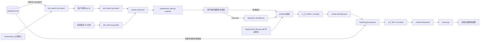

# 开发方向：岗位输入、有限来源搜索与候选人事实

状态：**可运行的本地工作流，尚非完整产品架构**。本文记录已实现行为、关键不变量与后续讨论方向；界面、材料批准和部署方式仍待决定。

## 工程尺度原则

后续仍按可验收增量推进，但每个增量按实际使用条件设计：真实事实会增长、内容会修改、检索可能误召回或漏召回、外部模型可能失败，个人数据范围必须可解释。不能因为当前样例少就把全部事实复制到每个岗位、跳过 schema 迁移、混合模块责任或让模型结果直接成为业务决定。新增结构需要说明数据量增长后的读取范围、版本失效条件、隐私边界和失败行为；尚未出现的并发、云部署和多用户需求仍不提前建设。

## 当前已实现

`facts.py` 使用本机 SQLite 保存事实文本、分类、标签、版本和独立人工确认，支持从 JSON 批量导入 pending 事实和原子化批量确认，并提供有限候选检索；`job_search.py` 读取 Greenhouse 招聘板，用事实库标签在本机排序，选岗后只保存 JD 快照，也接受用户粘贴的任意来源 JD；`requirement_flow.py` 按中英文常见标题提取并确认 JD 要求，允许用户手动补充 JD 原文要求，可选调用 TypeSafe/Jev 增加结构化语义判断；`matching.py` 在要求确认后按分类与标签检索少量当前已确认事实，再记录人工关联或明确无匹配；`review.py` 校验要求、事实及版本绑定，输出双侧原文或未知。目前没有材料批准、自动申请或网页界面。样例和离线测试使用合成数据；Greenhouse 公开接口和 TypeSafe API 已分别做过只读/合成数据探测，新加入的 TypeSafe 适配代码尚未用轮换后的 key 做真实联网回归。

## 当前代码结构与数据流

当前是由本机 SQLite 和 JSON 快照连接的命令行流水线，还没有网页界面或 LangGraph 编排。

```text
项目/
├── facts.py                      # 保存事实版本与人工确认
├── job_search.py                 # 搜索岗位并获取选中的 JD
├── requirement_flow.py           # 提取候选要求并记录人工决定
├── typesafe_classifier.py        # 调用 TypeSafe/Jev 做语义判断
├── matching.py                   # 检索事实候选并记录人工关联
├── review.py                     # 校验要求与候选人事实证据
├── test_job_search.py
├── test_facts.py
├── test_requirement_flow.py
├── test_matching.py
├── test_typesafe_classifier.py
├── test_review.py
├── test_end_to_end.py            # 粘贴 JD 到审核结果的离线全流程
├── examples/                     # 合成输入样例（含中文 JD 与事实导入文件）
├── README.md                     # 运行入口和当前限制
├── development.md                # 开发方向与已确认设计
└── .local/
    ├── workbench.db              # 本机候选人事实库，不提交 Git
    └── *.json                    # 审核流程快照，不提交 Git
```



各模块的责任边界如下：

| 模块 | 负责 | 不负责 |
| --- | --- | --- |
| `facts.py` | 保存逻辑事实及版本化文本、粗分类和标签；批量导入与原子化确认；管理确认；提供搜索与检索共用的标签匹配规则；按查询和类型返回有限的当前已确认候选。 | 从简历自动推断事实、判断某条事实是否支持具体 JD 要求或保存搜索结果。 |
| `job_search.py` | 获取、筛选和重新读取 Greenhouse JD；接收用户粘贴的 JD；用本地标签提供词面排序；生成纯 JD 审核输入。 | 加载整份事实库、判断候选人资格、核验粘贴来源或决定事实关联。 |
| `requirement_flow.py` | 从已知章节复制原文候选；接收必须是 JD 原文的手动补充；生成稳定 ID；执行要求的 `pending`、`confirmed`、`excluded` 状态转换。 | 关联候选人事实或创造 JD 中不存在的要求。 |
| `typesafe_classifier.py` | 向 Jev 提出窄问题；校验并保留 Noul/Choice 概率、置信度和实际模型版本。 | 改变候选状态、选择事实依据或代替人工决定。 |
| `matching.py` | 将已确认要求映射为类型偏好，检索事实候选，绑定人工 `link/no-match` 决定，并检查候选事实版本是否仍有效。 | 自动证明语义支持、读取历史/未确认事实或向外部模型发送个人资料。 |
| `review.py` | 校验要求原文、事实存在性、确认状态和精确版本；输出双侧证据或未知。 | 证明录取概率、补全缺失事实或批准最终材料。 |

数据会经过一个本地权威事实库和五个主要文件状态：

1. `workbench.db`：保存事实及所有版本；只有当前且已确认的版本可以导出。
2. `review-input.json`：只保存本次 JD 快照以及空的 `facts`、`selected_requirements`。
3. `review-candidates.json`：增加 `requirement_candidates`；使用 `--typesafe` 时，每个候选还带 `semantic_judgment`，但状态仍是 `pending`。
4. `review-decided.json`：用户明确确认或排除要求；此阶段不关联事实。
5. `review-matches.json`：为每条已确认要求保存有限的事实候选、事实版本和检索依据，状态仍是 `pending`。
6. `review-linked.json`：保存人工 `link/no-match` 决定，只复制最终选中的事实及其精确版本。

当前核心分工是：确定性代码管理原文、状态、版本、有限检索和文件副作用；Jev 只为 JD 候选提供可检查的语义信号；用户确认要求并决定事实关联。这个结构避免了岗位获取阶段接触整份个人事实，也保证模型输出和检索命中都不能直接变成已确认业务事实。

## 大体方向

1. **岗位输入省时**：当前已支持按 Greenhouse 招聘板标识获取公开岗位，并在选岗时重新读取 JD；任何来源的 JD 都可以用 `paste` 手动粘贴，未提供链接时来源记为未知。下一步可考虑直接接受单条官方岗位链接。实际使用的原文、来源和获取时间可以写入本地审核输入文件，但尚无数据库版本管理。获取时间不等于官方发布时间，历史快照不证明岗位现在仍开放。[Greenhouse Job Board API](https://docs.greenhouse.io/job-board.html) 已接入；[Lever Postings API](https://github.com/lever/postings-api) 尚未接入。
2. **候选人事实复用**：SQLite v2 已实现手动录入、JSON 批量导入、粗分类、多标签、修改留版本、明确确认（可一次确认多个精确版本）、标签搜索排序和按要求检索。新版本先进入 pending，旧版本确认不能覆盖新内容。从简历原文自动提取事实尚未实现；批量导入不会修改已有事实，也还没有归档/停用事实的命令。
3. **来源和规则分离**：岗位接口或手动粘贴负责提供 JD；事实存储负责提供已确认版本；匹配与建议规则只消费这些输入。外部岗位数据库可作为发现线索或缓存，不能单凭其旧记录判断岗位仍开放。

## 有限来源岗位搜索（第一小步已实现）

当前用户提供一个 Greenhouse 招聘板标识，系统按需读取公开岗位，用标题、地点筛选，再用事实库中当前已确认版本的标签显示双侧词面候选依据，让用户通过岗位 ID 自行挑选。地点未知会保留并标明，资格保持未核验。选中岗位后重新读取公开接口，并新建只包含本次 JD、来源和获取时间的审核输入；候选人事实等到要求确认后再检索。后续才考虑保存多个关注来源或跨次搜索；不承诺全网覆盖，也不把排序结果解释为录取概率。

这比单条 URL 导入多出“从哪里找岗位、如何合并不同来源、如何排序”的工作。每增加一家招聘系统，需要读取接口把其字段整理为相同的岗位记录；Greenhouse、Lever、[Ashby](https://developers.ashbyhq.com/docs/public-job-posting-api) 的公开接口均按公司招聘板提供岗位，并非一个跨平台搜索接口。

| 技术与状态 | 在这一步解决的问题 |
| --- | --- |
| **已有：Python 标准库、JSON、`unittest`** | 无第三方运行依赖；离线测试检查确定规则，公开接口另做实际验证。 |
| **已有第一版：Greenhouse 公开只读 HTTP 接口** | 一次读取一个招聘板，选岗后按 ID 重新读取；设置超时与响应大小限制，接口失败明确报错；候选人事实只在本机参与排序。 |
| **已有第一版：规范化岗位记录** | 关联来源、来源内岗位 ID、官方链接、标题、地点、描述和获取时间；一次响应内按 ID 去重。选中的 JD 可写入本地审核输入文件，尚无数据库版本管理。 |
| **已有第一版：筛选与词面候选依据** | 标题和地点筛选，地点未知单独标识；显示 JD 片段和事实原文，资格保持未核验。尚未进行语义匹配、资格判断或缺口提取。 |
| **按需要引入：本机 SQLite 岗位缓存、全文索引** | 当需要保留关注来源、跨次搜索、历史快照或搜索量明显增加时再加入；少量来源的首次按需搜索可先在内存中筛选。 |

搜索到审核输入的首个可验收闭环已完成：对一个 Greenhouse 招聘板取回岗位，用合成事实和固定规则显示候选列表、依据及未知项；重复 ID 不重复展示，接口失败不沿用旧结果；用户选择后重新读取接口并生成审核输入。输出文件不覆盖已有版本。当前只说明词面相关性，仍需人选择要求并检查岗位要求和事实的实际语义。排序依据是命中的不同标签数量，同一标签被多条事实共享只算一次，避免某个技能写了很多条事实就压过覆盖面更广的岗位。接口超时、连接失败、429 和 5xx 只重试一次；两次失败仍明确报错，不沿用旧结果。

## 候选人事实库与检索（已实现）

`facts.py` 使用 Python 标准库 `sqlite3` 管理 `.local/workbench.db`。`facts` 表保存逻辑事实和当前版本指针；`fact_versions` 保存每一版原文、粗分类、`pending/confirmed` 状态及时间；`fact_tags` 保存与具体版本绑定的多个检索标签。数据库使用 `PRAGMA user_version = 2`；程序在事务中把 v1 迁移到 v2，保留所有旧文本和确认状态，旧记录安全归类为 `other`、标签为空。本轮没有引入第三方 ORM。

新增事实必须选择 `project/experience/skill/education/eligibility/availability/achievement/other` 之一，并可提供多个标签。文本、分类和标签作为同一个版本共同确认；修改任一字段都会创建新的 `pending` 版本。确认操作必须指定当前版本号，旧版本不能在产生新版本后恢复为当前内容。相同完整载荷的重复添加或修改返回已有记录。

岗位列表搜索先只读取当前已确认版本的标签和事实 ID；排序完成后，再只为最终展示的岗位及其命中证据读取事实原文。岗位结果最多 100 条，每个岗位最多展示 20 条证据。事实匹配阶段也先扫描标签元数据，再只读取标签命中或类型相关的有限事实正文。岗位排序和事实检索共用 `facts.tag_pattern`：英文标签只以英文字母、数字为边界，避免 `C` 命中 `experience`，同时让 `熟悉Python` 命中 `Python`；中文标签使用子串匹配；只有一两个字母/数字的短标签区分大小写且不能紧挨 `&`（单字母还不能紧挨 `-`），避免 `go to market`、`R&D`、`C-suite` 误命中。代价是句首 `Go` 这类情况仍会误命中，`AI-powered` 这类写法则会保留命中。未确认、历史和无关类型不会被复制到岗位快照。

`facts.py import` 先校验整份 JSON，再在一个事务中把全部条目写为 `pending`，因此一条无效就整批不写入；重复导入同一完整载荷复用已有事实。`confirm` 可一次接收多个 `FACT_ID@VERSION`，也在一个事务中执行：任何一个不是当前版本就全部不确认。导入不会修改已有事实，修改仍通过 `revise` 产生新版本。

这一设计保持的业务不变量是：被选择用于审核的文本、分类和标签必须来自用户明确确认过的当前事实版本。代价是修改任一字段后，在确认新版本前该事实暂时不可检索；系统不会悄悄退回已被修正的旧版本。

## 候选要求提取与人工决定（第一小步已实现）

`requirement_flow.py` 在 `Requirements`、`Qualifications`、`What we're looking for`、`Nice to have`、`岗位要求`、`任职要求`、`加分项` 等已知章节中，把分行原文提取为候选要求（`section-lines-v2`）。它会规范化章节标题两侧的 emoji、Markdown 粗体、中文括号、`一、`/`1.` 编号、冒号和省略号，并支持 `任职要求：熟悉 Python` 这种标题与内容同一行的写法；候选正文会去掉 `1、`、`（1）` 等列表编号，但必须仍是 JD 中的确切片段。最短长度按中文字符计 2、ASCII 字符计 1，使 `本科及以上学历` 这类中文要求不被当作噪声丢弃。候选 ID 由原文内容生成，因此同一原文重复运行得到相同 ID。

规则漏掉的要求可以通过 `add` 手动补充（`manual-quote-v1`）：文字必须是 JD 原文片段（可以是一行中的一部分），已有候选不能重复添加，已进入事实匹配的文件不能再添加。手动补充同样从 `pending` 开始，仍需 `decide` 确认。

候选要求起始状态为 `pending`。用户通过 `decide` 明确改为 `confirmed` 或 `excluded`；这个阶段只决定哪些 JD 原文是真正要求，不再接受事实 ID。只有 `confirmed` 候选会生成带稳定要求 ID 的 `selected_requirements`，再交给 `matching.py`。输出写入新文件，已有文件不会被覆盖。

## 事实候选匹配与人工绑定（已实现）

`matching.py propose` 只消费已确认的 JD 要求。它把 Jev 的要求类别当作检索偏好而非事实：技能或经验要求优先检索 `project/experience/skill/achievement`，教育或资格要求优先检索 `education/eligibility`，同时保留跨类型的明确标签命中。没有 Jev 类别时只依赖标签命中，避免凭未知分类全量读取事实。

每个候选保存要求 ID 与原文、事实 ID 与精确版本、事实原文、分类、标签以及命中的检索依据。`matching.py decide` 只允许关联已经展示的候选；也可以明确记录 `no-match`。决定发生时会重新查询数据库，确保候选版本仍是当前且已确认，文本、分类或标签变化都会使旧候选失效。多次决定可逐步完成不同要求，已有绑定和已选事实不会丢失。

当前匹配是本地候选检索加人工决定，不声称语义支持已被自动证明。TypeSafe 尚未接收任何候选人事实；若未来增加语义复核，需要单独确定发送字段、真实数据授权、调用预算和评估样本。

默认模式采用确定性章节规则，因为它便于检查遗漏和误提取，也不需要把 JD 或候选人资料发送给模型。代价是未知章节标题会得到零候选（需用 `add` 手动补充），列表中的日期等子项可能被拆成独立候选，也不会自动判断 required 与 preferred 的语义强度。可选 TypeSafe 模式补充了语义判断，但当前仍只处理规则已经找到的候选，因此没有解决未知章节遗漏。

## TypeSafe/Jev 语义判断（第一小步已实现）

`requirement_flow.py propose --typesafe` 调用 `typesafe_classifier.py`。程序把一份 JD 快照和规则找到的候选要求组成命名 JSON state，再对每个候选并行提出三个窄问题：它是否是申请人需要满足的要求、它主要属于哪一类、它表达的是 required、preferred 还是不明确/并非要求。Noul 返回“是”的概率；两个 Choice 保留选择、完整概率分布和置信度。输出同时记录请求的模型别名与 API 实际返回的版本，避免把可能移动的 `jev-latest` 当作固定版本。

Jev 在这里是**语义判断器**，不是业务决策者。代码继续控制原文候选范围、ID、状态转换、文件写入和人工确认。无论概率多高，候选都保持 `pending`；只有显式 `decide --confirm/--exclude` 才改变状态。这样保持的不变量是：外部模型输出不能替代用户对具体 JD 原文的决定。未来只有在积累代表性标注样本并测量误提取、漏提取后，才值得讨论阈值或自动分流。

这一步直接使用 Python 标准库调用官方 HTTP API，没有安装社区同名包，也没有新增运行依赖。API key 只从 `TYPESAFE_API_KEY` 环境变量读取，不写入请求结果或错误信息。发送内容只含 JD 原文与候选要求，不含 `facts` 候选人事实；这减少了个人数据外传，但 JD 本身仍会离开本机。服务失败、答案缺失、选项无效或概率越界时，整个命令失败且不创建输出文件。零候选时不发请求。

当前主要限制是“先规则提候选，再让 Jev 判断”：它能帮助识别要求、职责、福利和上下文之间的混淆，却不能发现规则从未提出的原文片段。下一次若要扩展，应先用一组真实但脱敏的 JD 标注“应提取的原文”，比较当前规则与更宽候选生成方案，再决定让 Jev 做过滤还是直接做受约束选择。

## 推荐但尚待确认的选择

- 已接入 Greenhouse 作为首个招聘系统。是否扩展 Lever、Ashby 或直接解析岗位链接，取决于用户实际关注的岗位来源。

## 重点与难点

| 重点 | 难点及验收方向 |
| --- | --- |
| 获取到**实际使用的 JD 内容**，让用户只需给链接 | 不同招聘系统的 URL 和字段不同；接口失败时要明确失败并提供手动入口，不能沿用旧内容冒充最新。验收：成功读取后记录原文、来源、获取时间；失败时没有“当前开放”的结论。 |
| 让**事实确认有独立来源** | SQLite 第一版已提供独立确认入口。当前仍缺少简历导入后的逐项审核界面。验收：未确认事实不会进入新审核输入；确认当前版本后可引用；修改后必须重新确认。 |
| 保持**版本关联** | 事实匹配已绑定精确事实版本，并在人工决定时重新检查当前性；JD、草稿和未来材料批准的完整版本关联仍未实现。验收：旧事实候选在事实修改后必须失效；未来批准也必须绑定具体材料与输入版本。 |

下一步应根据实际使用场景选择：为事实、要求和匹配决定增加轻量审核界面，或在获得真实数据范围授权后评估受约束的语义复核。简历导入仍需设计“提取为 pending 候选、逐项确认、来源定位和重复合并”；搜索 profile 中的 `confirmed: true` 仍只是输入声明。

2026-09-22 提出、尚待用户确认的后续顺序：B. 每个岗位一条引导式命令（或本地网页），减少 7 条命令和手工复制 ID；C. 基于已绑定证据生成受事实约束的简历要点/求职信，每句关联事实版本，经人工批准后导出，批准绑定具体内容与输入版本；D. 投递记录（岗位、日期、状态、所用已批准材料版本）。C 是否调用外部模型、使用哪家服务以及能否发送候选人事实，需要用户单独授权。
