# 开发方向：岗位输入、有限来源搜索与候选人事实

状态：**可运行的本地工作流，尚非完整产品架构**。本文记录已实现行为、关键不变量与后续讨论方向；界面、材料批准和部署方式仍待决定。

## 本地开发入口

以下命令从仓库根目录运行；测试位于 `tests/`，全部使用合成资料和离线模型替身。

```sh
python3 -m venv .venv
.venv/bin/python -m pip install -r requirements.txt
.venv/bin/python -m unittest discover -s tests -t . -p "test_*.py"
.venv/bin/python -m unittest tests.test_review -v
.venv/bin/python web.py
```

网页启动后访问 `http://127.0.0.1:8765/`。真实 AI 功能的数据去向与授权要求仍见下文；运行离线测试无需模型密钥。

## 工程尺度原则

后续仍按可验收增量推进，但每个增量按实际使用条件设计：真实事实会增长、内容会修改、检索可能误召回或漏召回、外部模型可能失败，个人数据范围必须可解释。不能因为当前样例少就把全部事实复制到每个岗位、跳过 schema 迁移、混合模块责任或让模型结果直接成为业务决定。新增结构需要说明数据量增长后的读取范围、版本失效条件、隐私边界和失败行为；尚未出现的并发、云部署和多用户需求仍不提前建设。

## 当前已实现

`facts.py` 使用本机 SQLite 保存事实文本、分类、标签、版本和独立人工确认，支持从 JSON 批量导入 pending 事实和原子化批量确认，并提供有限候选检索；`job_search.py` 读取 Greenhouse、Lever、Ashby 公开招聘板，用事实库标签在本机排序，选岗后只保存 JD 快照，也接受用户粘贴的任意来源 JD；`requirement_flow.py` 按中英文常见标题提取并确认 JD 要求，允许用户手动补充 JD 原文要求，可选调用 TypeSafe/Jev 增加结构化语义判断；`matching.py` 在要求确认后按分类与标签检索少量当前已确认事实，再记录人工关联或明确无匹配；`review.py` 校验要求、事实及版本绑定，输出双侧原文或未知；`cv.py` 用本机简历 profile 和当前已确认事实生成中英文简历草稿，并通过无界面 Chrome 导出带草稿水印的 PDF。目前没有材料批准、AI 改写、自动申请或网页界面。样例和离线测试使用合成数据；Greenhouse 公开接口和 TypeSafe API 已分别做过只读/合成数据探测，新加入的 TypeSafe 适配代码尚未用轮换后的 key 做真实联网回归。

## 当前代码结构与数据流

当前是由本机 SQLite 和 JSON 快照连接的命令行流水线，还没有网页界面或 LangGraph 编排。

```text
项目/
├── facts.py                      # 保存事实版本与人工确认
├── job_search.py                 # 读取 Greenhouse/Lever/Ashby 招聘板并获取选中的 JD
├── listings.py                   # 关注的公司、已下载岗位与按已确认技能排序
├── starter_boards.json           # 新建 listings.db 时预置的 30 家公司
├── requirement_flow.py           # 提取候选要求并记录人工决定
├── typesafe_classifier.py        # 调用 TypeSafe/Jev 做 JD 语义判断
├── semantic_review.py            # 默认关闭的 Jev 改写语义观察；独立报告，不参与批准
├── matching.py                   # 检索事实候选并记录人工关联
├── review.py                     # 校验要求与候选人事实证据
├── cv.py                         # 简历草稿、DeepSeek 改写与 PDF
├── cv_layout.py                  # 每个岗位显示哪些栏目/条目/行及顺序（护栏、改动列表、撤销）
├── cv_plan.py                    # DeepSeek 提出按岗位的结构调整，经护栏后使用
├── cv_import.py                  # 上传的 PDF 简历 → 待确认事实与 profile（联系方式留在本机）
├── gaps.py                       # 每条要求的证据与这份简历是否显示、补充建议与用户确认后加入
├── claims.py                     # 改写行的确定性事实检查
├── deepseek_client.py            # DeepSeek JSON 调用与 key 读取
├── workspace.py                  # 网页用：每个岗位一个文件夹与历史
├── web.py                        # 网页用：FastAPI 薄层与本机访问保护
├── web/                          # 网页前端（HTML、原生 JS、CSS）
├── requirements.txt              # 仅网页需要的依赖（固定版本）
├── tests/                        # 离线测试与合成测试工具
├── examples/                     # 合成输入样例（含中文 JD 与事实导入文件）
├── README.md                     # 运行入口和当前限制（英文）
├── README.zh-CN.md               # 同一内容的中文版
├── docs/                        # 开发记录与部署说明
│   └── development.md           # 开发方向与已确认设计
└── .local/
    ├── workbench.db              # 本机候选人事实库，不提交 Git
    └── *.json                    # 审核流程快照，不提交 Git
```



```mermaid
flowchart LR
    DB[(workbench.db)] -->|标签用于本地排序| B
    A[Greenhouse 公开接口] --> B[job_search.py search]
    B --> C[用户选择 job_id]
    C --> D[job_search.py select]
    D --> E[review-input.json]
    Q[任意来源 JD 文本] --> R[job_search.py paste]
    R --> E
    E --> F[requirement_flow.py propose]
    F --> G[章节规则提取原文候选]
    G -->|普通模式| H[pending 候选]
    G -->|--typesafe| I[typesafe_classifier.py]
    I --> H
    S[requirement_flow.py add 手动原文] --> H
    H --> J[人工 confirm / exclude]
    J --> K[review-decided.json]
    K --> L[matching.py propose]
    DB -->|按要求检索有限候选| L
    L --> N[人工 link / no-match]
    N --> O[review-linked.json]
    O --> P[review.py]
    CP[cv-profile.json] --> CV[cv.py draft]
    DB -->|profile 引用的已确认事实| CV
    O -.->|--job 调整行序| CV
    CV -->|可选| TL[cv.py tailor]
    TL -->|只发送要点原文与岗位要求| DS[DeepSeek]
    DS -->|claims.py 逐行检查| TL
    TL --> CX
    CV --> CX[cv.py pdf 再次核对]
    CX --> CH[无界面 Chrome] --> PDF[带草稿水印的 PDF]
    P --> M[双侧证据审核结果]
```

各模块的责任边界如下：

| 模块 | 负责 | 不负责 |
| --- | --- | --- |
| `facts.py` | 保存逻辑事实及版本化文本、粗分类和标签；批量导入与原子化确认；管理确认；提供搜索与检索共用的标签匹配规则；按查询和类型返回有限的当前已确认候选。 | 从简历自动推断事实、判断某条事实是否支持具体 JD 要求或保存搜索结果。 |
| `job_search.py` | 获取、筛选和重新读取 Greenhouse JD；接收用户粘贴的 JD；用本地标签提供词面排序；生成纯 JD 审核输入。 | 加载整份事实库、判断候选人资格、核验粘贴来源或决定事实关联。 |
| `requirement_flow.py` | 从已知章节复制原文候选；接收必须是 JD 原文的手动补充；生成稳定 ID；执行要求的 `pending`、`confirmed`、`excluded` 状态转换。 | 关联候选人事实或创造 JD 中不存在的要求。 |
| `typesafe_classifier.py` | 向 Jev 提出窄问题；校验并保留 Noul/Choice 概率、置信度和实际模型版本。 | 改变候选状态、选择事实依据或代替人工决定。 |
| `matching.py` | 将已确认要求映射为类型偏好，检索事实候选，绑定人工 `link/no-match` 决定，并检查候选事实版本是否仍有效。 | 自动证明语义支持、读取历史/未确认事实或向外部模型发送个人资料。 |
| `review.py` | 校验要求原文、事实存在性、确认状态和精确版本；输出双侧证据或未知。 | 证明录取概率、补全缺失事实或批准最终材料。 |
| `cv.py` | 校验简历 profile；把引用的当前已确认事实逐字放入中英文草稿；按岗位请求 DeepSeek 改写并只保留通过检查的行；记录用户对具体内容的批准；导出前再次核对版本、原文或改写检查及批准指纹；渲染转义后的 HTML 并调用 Chrome 生成 PDF。 | 替用户批准、把 profile 中的姓名、联系方式、学校和公司名称发送给任何外部服务。 |
| `claims.py` | 对单行改写做确定性检查：新数字、新技术或技能词、更强的职责表述、链接和格式。 | 判断语义是否等价；它只能拦截词面上可识别的夸大。 |
| `deepseek_client.py` | 以 JSON 模式调用 DeepSeek，有限重试与空内容重试，校验响应，从环境变量或钥匙串读取 key。 | 决定发送哪些数据或是否采用结果。 |
| `workspace.py` | 管理 `.local/jobs/<岗位编号>/` 中每一步的当前文件；重做时把该步及后续文件移入 `history/`；中英文简历互不影响；阻止路径越界。 | 业务校验，也不理解文件内容。 |
| `web.py` | 用 FastAPI 把已有函数暴露给本机网页；Host 检查与每次启动的随机令牌；把领域错误转成 400。 | 自己实现任何提取、匹配、改写或批准规则。 |

数据会经过一个本地权威事实库和五个主要文件状态：

1. `workbench.db`：保存事实及所有版本；只有当前且已确认的版本可以导出。
2. `review-input.json`：只保存本次 JD 快照以及空的 `facts`、`selected_requirements`。
3. `review-candidates.json`：增加 `requirement_candidates`；使用 `--typesafe` 时，每个候选还带 `semantic_judgment`，但状态仍是 `pending`。
4. `review-decided.json`：用户明确确认或排除要求；此阶段不关联事实。
5. `review-matches.json`：为每条已确认要求保存有限的事实候选、事实版本和检索依据，状态仍是 `pending`。
6. `review-linked.json`：保存人工 `link/no-match` 决定，只复制最终选中的事实及其精确版本。

当前核心分工是：确定性代码管理原文、状态、版本、有限检索和文件副作用；Jev 只为 JD 候选提供可检查的语义信号；用户确认要求并决定事实关联。这个结构避免了岗位获取阶段接触整份个人事实，也保证模型输出和检索命中都不能直接变成已确认业务事实。

## 大体方向

1. **岗位输入省时**：当前已支持按 Greenhouse 招聘板标识获取公开岗位，并在选岗时重新读取 JD；任何来源的 JD 都可以用 `paste` 手动粘贴，未提供链接时来源记为未知。下一步可考虑直接接受单条官方岗位链接。实际使用的原文、来源和获取时间可以写入本地审核输入文件，但尚无数据库版本管理。获取时间不等于官方发布时间，历史快照不证明岗位现在仍开放。[Greenhouse Job Board API](https://docs.greenhouse.io/job-board.html)、[Lever Postings API](https://github.com/lever/postings-api) 和 [Ashby 公开岗位接口](https://developers.ashbyhq.com/docs/public-job-posting-api) 已接入。
2. **候选人事实复用**：SQLite v2 已实现手动录入、JSON 批量导入、粗分类、多标签、修改留版本、明确确认（可一次确认多个精确版本）、标签搜索排序和按要求检索。新版本先进入 pending，旧版本确认不能覆盖新内容。从简历原文自动提取事实尚未实现；批量导入不会修改已有事实，也还没有归档/停用事实的命令。
3. **来源和规则分离**：岗位接口或手动粘贴负责提供 JD；事实存储负责提供已确认版本；匹配与建议规则只消费这些输入。外部岗位数据库可作为发现线索或缓存，不能单凭其旧记录判断岗位仍开放。

## 有限来源岗位搜索（第一小步已实现）

当前用户提供一个 Greenhouse 招聘板标识，系统按需读取公开岗位，用标题、地点筛选，再用事实库中当前已确认版本的标签显示双侧词面候选依据，让用户通过岗位 ID 自行挑选。地点未知会保留并标明，资格保持未核验。选中岗位后重新读取公开接口，并新建只包含本次 JD、来源和获取时间的审核输入；候选人事实等到要求确认后再检索。保存多个关注来源和跨次排序已在下一节实现；不承诺全网覆盖，也不把排序结果解释为录取概率。

这比单条 URL 导入多出“从哪里找岗位、如何合并不同来源、如何排序”的工作。每增加一家招聘系统，需要读取接口把其字段整理为相同的岗位记录；Greenhouse、Lever、[Ashby](https://developers.ashbyhq.com/docs/public-job-posting-api) 的公开接口均按公司招聘板提供岗位，并非一个跨平台搜索接口。

| 技术与状态 | 在这一步解决的问题 |
| --- | --- |
| **已有：Python 标准库、JSON、`unittest`** | 无第三方运行依赖；离线测试检查确定规则，公开接口另做实际验证。 |
| **已有第一版：Greenhouse 公开只读 HTTP 接口** | 一次读取一个招聘板，选岗后按 ID 重新读取；设置超时与响应大小限制，接口失败明确报错；候选人事实只在本机参与排序。 |
| **已有第一版：规范化岗位记录** | 关联来源、来源内岗位 ID、官方链接、标题、地点、描述和获取时间；一次响应内按 ID 去重。选中的 JD 可写入本地审核输入文件，尚无数据库版本管理。 |
| **已有第一版：筛选与词面候选依据** | 标题和地点筛选，地点未知单独标识；显示 JD 片段和事实原文，资格保持未核验。尚未进行语义匹配、资格判断或缺口提取。 |
| **已有：本机 SQLite 岗位库（`listings.py`）；全文索引仍按需要引入** | 保存关注的公司和下载的岗位，跨次排序见下一节；约 9 千个岗位时保存匹配结果已足够快，暂不需要全文索引。 |

搜索到审核输入的首个可验收闭环已完成：对一个 Greenhouse 招聘板取回岗位，用合成事实和固定规则显示候选列表、依据及未知项；重复 ID 不重复展示，接口失败不沿用旧结果；用户选择后重新读取接口并生成审核输入。输出文件不覆盖已有版本。当前只说明词面相关性，仍需人选择要求并检查岗位要求和事实的实际语义。排序依据是命中的不同标签数量，同一标签被多条事实共享只算一次，避免某个技能写了很多条事实就压过覆盖面更广的岗位。接口超时、连接失败、429 和 5xx 只重试一次；两次失败仍明确报错，不沿用旧结果。

## 关注公司与自动排序（Find jobs，已实现）

2026-09-25 用户要求：确认技能后，系统应自动把岗位按匹配多少排好，不需要先选筛选条件。来源选定为 Greenhouse + Lever + Ashby，起始公司列表由我预置、用户增删。

- **问题**：以前只能一次搜一个 Greenhouse 招聘板或逐条粘贴 JD，用户没有“岗位库”可看。
- **选择**：新增 `listings.py` 和独立的 `.local/listings.db`（sources、listings 两张表）。岗位是公开数据的本地副本，和权威的事实库分开：删掉它不影响事实和已开始的岗位。每家公司刷新时整体替换其岗位，记录首次看到时间；读取失败时保留上次成功的副本并记录错误，不把旧数据说成最新。起始公司只在数据库第一次创建时加入，用户删掉的公司不会在下次启动时回来。
- **排序**：命中的不同已确认标签数（与 `rank_jobs` 同一词面规则，pending 事实不算），同分按发布时间新到旧；各招聘系统的发布时间统一换成 UTC 再比较。同一公司、同标题、同正文的多个城市发布合并为一行。“Hide senior roles” 按标题排除 Senior/Staff/Principal/Lead/Manager/Director 等，但保留 OpenAI、Anthropic、Cohere 给所有工程师用的 “Member of Technical Staff”。
- **速度**：30 家公司约 8,800 个岗位，逐个正则匹配 83 个标签约 25 秒。`facts.tag_finder` 先在折叠大小写的文本里做子串检查，只有可能命中的标签才跑正则，结果与只用 `tag_pattern` 完全相同（测试逐一比较，包括 Python 正则把土耳其语 ı/İ 视为 i 的情况），快约 6 倍。匹配结果按“标签集合的哈希”保存在每个岗位上；标题或正文变化、或已确认标签变化时才重算。实测首次约 5 秒，之后约 0.05 秒。
- **刷新**：没有后台定时任务。打开 Find jobs 时，超过 24 小时未更新的公司由浏览器每次 4 家并行刷新（实测 30 家约 6 秒）；一家失败不影响其他家。
- **开始岗位**：Start 会按岗位 ID 重新读取官方接口（Ashby 没有单岗位接口，就重读整个招聘板再取该岗位），生成与粘贴 JD 相同的审核输入；Lever、Ashby 不返回公司名，用关注列表里的名称补上。以官方链接识别同一岗位，加锁防止并发点击，所以同一岗位只会有一个 My jobs 条目。
- **代价与限制**：数据库约 64 MB；排序是词面计数，实测 “AI” 出现在 79% 的岗位里，数字只适合比较先后；地点筛选只是“包含文字”。以后若需要“只看美国”或按技能重要性加权，再在这一层增加，不影响事实和审核流程。
- **验证**：`test_listings.py`（排序、分组、筛选、隐藏资深、刷新与失败保留、起始列表只加一次、确认新技能后重算）、`test_job_search.py`（Lever/Ashby 字段、链接识别、UTC 日期、单岗位重读）、`test_web.py`（关注公司、排序接口、Start 不重复）。另外在真实服务器上下载了 30 家公司并截图检查页面。

## 候选人事实库与检索（已实现）

`facts.py` 使用 Python 标准库 `sqlite3` 管理 `.local/workbench.db`。`facts` 表保存逻辑事实和当前版本指针；`fact_versions` 保存每一版原文、粗分类、`pending/confirmed` 状态及时间；`fact_tags` 保存与具体版本绑定的多个检索标签。数据库使用 `PRAGMA user_version = 2`；程序在事务中把 v1 迁移到 v2，保留所有旧文本和确认状态，旧记录安全归类为 `other`、标签为空。本轮没有引入第三方 ORM。

新增事实必须选择 `project/experience/skill/education/eligibility/availability/achievement/other` 之一，并可提供多个标签。文本、分类和标签作为同一个版本共同确认；修改任一字段都会创建新的 `pending` 版本。确认操作必须指定当前版本号，旧版本不能在产生新版本后恢复为当前内容。相同完整载荷的重复添加或修改返回已有记录。

岗位列表搜索先只读取当前已确认版本的标签和事实 ID；排序完成后，再只为最终展示的岗位及其命中证据读取事实原文。岗位结果最多 100 条，每个岗位最多展示 20 条证据。事实匹配阶段也先扫描标签元数据，再只读取标签命中或类型相关的有限事实正文。岗位排序和事实检索共用 `facts.tag_pattern`：英文标签只以英文字母、数字为边界，避免 `C` 命中 `experience`，同时让 `熟悉Python` 命中 `Python`；中文标签使用子串匹配；只有一两个字母/数字的短标签区分大小写且不能紧挨 `&`（单字母还不能紧挨 `-`），避免 `go to market`、`R&D`、`C-suite` 误命中。代价是句首 `Go` 这类情况仍会误命中，`AI-powered` 这类写法则会保留命中。未确认、历史和无关类型不会被复制到岗位快照。

`facts.py import` 先校验整份 JSON，再在一个事务中把全部条目写为 `pending`，因此一条无效就整批不写入；重复导入同一完整载荷复用已有事实。`confirm` 可一次接收多个 `FACT_ID@VERSION`，也在一个事务中执行：任何一个不是当前版本就全部不确认。导入不会修改已有事实，修改仍通过 `revise` 产生新版本。

这一设计保持的业务不变量是：被选择用于审核的文本、分类和标签必须来自用户明确确认过的当前事实版本。代价是修改任一字段后，在确认新版本前该事实暂时不可检索；系统不会悄悄退回已被修正的旧版本。

## 候选要求提取与人工决定（第一小步已实现）

`requirement_flow.py` 在 `Requirements`、`Qualifications`、`What we're looking for`、`Nice to have`、`岗位要求`、`任职要求`、`加分项` 等已知章节中，把分行原文提取为候选要求（`section-lines-v3`）。它会规范化章节标题两侧的 emoji、Markdown 粗体、中文括号、`一、`/`1.` 编号、冒号和省略号，并支持 `任职要求：熟悉 Python` 这种标题与内容同一行的写法；候选正文会去掉 `1、`、`（1）` 等列表编号，但必须仍是 JD 中的确切片段。最短长度按中文字符计 2、ASCII 字符计 1，使 `本科及以上学历` 这类中文要求不被当作噪声丢弃。候选 ID 由原文内容生成，因此同一原文重复运行得到相同 ID。

v3 根据 2026-09 下载的 8,787 个公开岗位补充了各公司常用的要求标题（如 `What we look for`、`What We Require`、`You may be a good fit if you`、`Your background looks something like`），并把 `About OpenAI`、`Life at Palantir`、`Why Harvey`、薪资/福利/平等就业等短行视为章节结束。有多种小变体的标题用必须匹配整行的正则，所以 “You might thrive in this role if you enjoy …” 这样的句子仍是正文。找不到任何要求行的岗位比例由 Greenhouse 44%、Ashby 55%、Lever 78% 降到 9%、7%、1%；个别法律或平等就业说明行仍可能被当作候选，由用户排除。

规则漏掉的要求可以通过 `add` 手动补充（`manual-quote-v1`）：文字必须是 JD 原文片段（可以是一行中的一部分），已有候选不能重复添加，已进入事实匹配的文件不能再添加。手动补充同样从 `pending` 开始，仍需 `decide` 确认。

候选要求起始状态为 `pending`。用户通过 `decide` 明确改为 `confirmed` 或 `excluded`；这个阶段只决定哪些 JD 原文是真正要求，不再接受事实 ID。只有 `confirmed` 候选会生成带稳定要求 ID 的 `selected_requirements`，再交给 `matching.py`。输出写入新文件，已有文件不会被覆盖。

## 事实候选匹配与人工绑定（已实现）

`matching.py propose` 只消费已确认的 JD 要求。它把 Jev 的要求类别当作检索偏好而非事实：技能或经验要求优先检索 `project/experience/skill/achievement`，教育或资格要求优先检索 `education/eligibility`，同时保留跨类型的明确标签命中。没有 Jev 类别时只依赖标签命中，避免凭未知分类全量读取事实。

每个候选保存要求 ID 与原文、事实 ID 与精确版本、事实原文、分类、标签以及命中的检索依据。`matching.py decide` 只允许关联已经展示的候选；也可以明确记录 `no-match`。决定发生时会重新查询数据库，确保候选版本仍是当前且已确认，文本、分类或标签变化都会使旧候选失效。多次决定可逐步完成不同要求，已有绑定和已选事实不会丢失。

当前匹配是本地候选检索加人工决定，不声称语义支持已被自动证明。TypeSafe 尚未接收任何候选人事实；若未来增加语义复核，需要单独确定发送字段、真实数据授权、调用预算和评估样本。

默认模式采用确定性章节规则，因为它便于检查遗漏和误提取，也不需要把 JD 或候选人资料发送给模型。代价是未知章节标题会得到零候选（需用 `add` 手动补充），列表中的日期等子项可能被拆成独立候选，也不会自动判断 required 与 preferred 的语义强度。可选 TypeSafe 模式补充了语义判断，但当前仍只处理规则已经找到的候选，因此没有解决未知章节遗漏。

## 简历草稿与 PDF（第一步已实现）

`cv.py draft` 读取本机 `cv-profile.json`：姓名、联系方式和每个条目的学校/公司、职位、地点、日期由用户维护，条目正文只列事实 ID。文字字段可写成 `{"en", "zh"}`，缺少的语言回退到另一种并记录在 `language_fallbacks`，不会让程序自行翻译学校或公司名称。profile 先整体校验（未知字段、非 http(s) 链接、未知章节都报出具体路径），再读取引用事实；任何一条不存在或当前版本未确认，都整体拒绝并列出 `FACT_ID@VERSION`。草稿记录 profile 的 SHA-256、每条事实的精确版本、语言和纸张；`--job` 只把与岗位要求关联的事实排到条目前面。

`cv.py pdf` 在打印前再次核对：每条事实仍是草稿记录的已确认版本，且每行文字与该版本逐字相同。这样事实被修改或草稿被手工改写时不会导出未经确认的文字。HTML 对所有文字转义，只为 profile 中的 http(s) 链接生成超链接，并用 Content-Security-Policy 禁止任何网络加载。PDF 由本机 Chrome 以临时 profile 无界面打印；在 Claude Code 沙箱中观察到 Chrome 写完文件后不退出，因此以文件末尾出现 `%%EOF` 作为完成条件，再结束 Chrome 进程。输出总是新建文件，超过一页会提示。

为让 profile 可读地引用事实，`facts.py import` 支持可选的自定义 ID：新 ID 新建事实，内容相同不变，内容变化则生成新的 `pending` 版本；新 ID 与已有事实内容完全相同会被拒绝。

当前限制：所有 PDF 都带草稿水印，尚无批准记录；正文逐字使用事实原文，中文简历中的英文事实不会被翻译。用户真实简历已转换为 `.local/my-facts.json` 和 `.local/cv-profile.json`，并以 pending 状态导入本机事实库，待用户逐条确认。

## 按岗位改写（DeepSeek，第二步已实现）

`cv.py tailor` 从 `cv.py draft` 的原始草稿出发（已改写过的草稿会被拒绝），先用与导出相同的规则核对事实，再把教育细节、经历和项目要点、技能行逐行发给 DeepSeek，同时发送岗位标题和已确认的要求。姓名、联系方式、学校和公司名称以及论文都不发送，测试逐项断言。回答必须是 JSON，且每条请求的 `fact_id` 恰好对应一行，否则整体失败。

每行改写都经过 `claims.check_rewrite`：不允许出现事实中没有的数字；形似技术名的词（含数字、`.+#`、两个以上大写字母或驼峰）必须出现在事实原文或其标签中；草稿中任何事实的标签词（包括中文标签）出现在改写里，也必须属于该事实的原文或标签；在事实没有同类表述时，不允许 led/managed/owned 或 主导/带领/负责 等更强的职责词；不允许新增链接或邮箱，并限制为单行、300 字符以内。未通过的行保留事实原文，并把被拒绝的文字和原因记入草稿。导出时对已采用的改写重新运行同一检查，并要求 `source_text` 仍等于当前已确认版本；事实修改后旧改写不能导出。

2026-09-23 用合成资料实测 `deepseek-flash`（`reasoning_effort=low`）：英文请求 7 行全部原样返回并通过；中文请求 7 行全部翻译并通过，技术名保持英文，没有出现更强表述。单次约 620 个输入 token、1,100–1,700 个输出 token，耗时 6–7 秒。

限制：检查只看词面，“为内部工具”被改成“为多个团队的内部工具”这类不含数字和技术词的语义扩大不会被拦截，因此仍需人工逐行核对；在“不新增内容”的规则下，英文改写往往接近原文，主要价值在中文翻译和按岗位排序；批准流程尚未实现，所有 PDF 仍带草稿水印。

## 批准与最终导出（第三步已实现）

要保持的不变量：最终导出的具体内容，必须是用户审核过、且相关输入仍有效的那一版。`cv.py approve` 先用导出同样的规则核对草稿（事实仍是当前已确认版本；逐字行等于原文；改写行仍通过 `claims`），然后复制草稿并加入 `approval`：批准时间和 `content_sha256`。指纹覆盖除 `approval` 以外的全部草稿内容，因此同时绑定了 profile 哈希、事实版本、岗位摘要、DeepSeek 改写结果、语言和纸张。

`cv.py pdf` 对带 `approval` 的文件重新计算指纹：一致且事实核对通过才输出无水印的最终 PDF；指纹不一致直接拒绝，不会退回为草稿导出，以免用户误以为仍是批准版本。没有批准的草稿照常输出带水印 PDF。已批准的文件不能再改写或重复批准；需要修改时从 `cv.py draft` 重新开始，再次审核和批准。批准记录目前保存在批准文件内，而非数据库；未来投递记录需要引用批准版本时，可以记录这个指纹。

## 目的与自动流程（2026-09-26 调整）

用户明确：本项目的目的不是评判候选人是否符合岗位，而是帮助候选人针对每个岗位，用已确认的真实经历拿出最好的一版简历：哪些放前面、哪些删掉、怎样按岗位的说法改写。因此页面去掉了“是否匹配”的评分式呈现，流程改为自动完成到简历审核：

1. **要求**：`requirement_flow.find_requirements_with_model` 把 JD 按行编号发给 DeepSeek，只取回行号和 required/preferred；程序逐字复制这些行，所以模型只能挑选、不能改写要求。失败或一行也没找到时退回标题规则（`section-lines-v3`），并记录原因。关闭思考后每个岗位约 1 秒（开启时 4–20 秒，挑出的行相同）。找到的要求全部自动计入；用户仍可排除或补充。
2. **简历**：按 JD 语言选择中文或英文简历，`build_draft` → `tailor_draft`（关闭思考，真实简历上约 2 秒，结果与开启时相同）→ `cv_plan.plan_draft`。结构调整由 DeepSeek 返回目标布局，经 `cv_layout.guarded_layout` 护栏：只能排序和删去已有行；教育经历保留且位置不变；工作经历保持时间顺序、每段至少一行；省略某条目表示不变，删去必须明确（条目列出空行列表、行从列表中去掉、栏目不在栏目列表中）。
3. **改动与撤销**：简历文件保存全部行和改写，计划只记录布局和已撤销的改动 ID。预览、批准指纹和 PDF 都按“布局减去已撤销改动”显示，因此撤销不需要再调用模型，批准后任何撤销都需要重新批准。
4. **Talking points**：原来的要求—事实匹配改为可选的面试/求职信参考，`matches`/`linked` 不再是简历的前置步骤，重做它们不会归档简历。DeepSeek 匹配要求事实原文本身说明满足要求，年限、资深程度或领导经历必须有原文支持；失败时退回标签匹配。

发给 DeepSeek 的只有 JD 行、岗位要求和简历各行文字；不发送姓名、联系方式、学校、公司、项目名称或事实 ID（各行用 L1、F1 这样的临时编号，回答再换回事实 ID）。实测（Cloudflare Senior ML Engineer，真实简历副本）：Start 到可审核简历约 5 秒；计划把第一段实习中与 LLM 相关的条目提前、技能行 AI/ML 提前，没有删减（简历本就一页）。英文改写在严格事实规则下通常不改动措辞。

## 缺口与补充建议（2026-09-26）

（2026-09-28 起，判断哪些要求没有证据改由第 5 项的证据检查完成，见下文；补充建议与确认流程不变。）

用户要求：不显示已满足的要求，只显示缺口，并让 LLM 帮忙补上。编造经历与本项目的事实约束冲突，也会在面试或背景调查中伤害用户，因此实现为“建议 + 用户确认真实”：

- `gaps.find_gaps`：用 DeepSeek 严格匹配找出没有任何已确认事实支持的要求；再用一次 DeepSeek 为每条缺口最多建议一处补充（给某个技能行加条目，或在某个经历/项目条目下加一行，或说明没有诚实的补充）。程序丢弃指向不存在的行或条目、含数字、领导类用词、链接，或与简历已有内容重复的建议（实测模型曾把简历里已有的一行当作“新行”建议）。只发送要求文字和简历行文字。
- `gaps.accept_gap`：只在用户点 “True for me” 时执行。技能条目通过 `revise_fact` 生成该技能行的新版本并立即确认；新的一行通过 `add_fact` 生成新事实并确认，同时返回把它加入对应 profile 条目的新 profile；网页先把旧 profile 备份到 `profile-history/` 再写入，然后重新准备简历。`decline_gap` 把缺口标记为不属实，永不进入简历。
- 工作区新增 `gaps` 步骤，与 talking points 一样不影响简历；重做要求会归档它。
- 稳定性：未设置 temperature 时同一岗位一次得到 11 条缺口、下一次 4 条。现在所有 DeepSeek 调用使用 temperature 0，但边界要求仍会在 8–11 条之间波动；开启思考更慢（每次 40–55 秒）且不更稳定，三次并行投票也帮助有限（并行结果高度相关）。因此缺口按岗位保存，只有用户点 “Check again” 才重新判断。

## 简历语言（2026-09-26）

用户指出：只给了一种语言的简历，就不需要两个版本。`cv.profile_languages` 按 profile 中姓名填写的语言决定可用语言；用户只填了英文名，所以只生成英文简历，中文 JD 也用英文简历，页面不再显示中文简历区。若以后在 profile 中填写中文，中文简历会重新出现。

同时修复了中文翻译被误拒：事实检查原来只按字面比对，把“前端”“后端”（英文原句中的 frontend、backend 的翻译）和单复数不同的 “API/APIs” 当成新增技能，导致这些行退回英文。`claims.EQUIVALENTS` 列出常见中英技术词的对应关系，并把英文单复数视为同一词；原句在任何语言中都没有的词仍会被拒绝。论文标题保持英文原题，这也是中文简历的常见做法。

## 证据与审核的可靠性（2026-09-27，第一轮）

依据一份外部改进计划（保持现有方向：自动准备、用户审核批准；不增加 agent 或服务），先做了三项确定性修正：

- **事实检查**（`claims.check_rewrite`）：原来只检查新增数字、技术词和领导词，计划中的四个歪曲例子全部通过。现在另外拒绝：数字挪到别的对象（“2 services in 3 weeks” → “3 services in 2 weeks”，比较“数字 + 其后名词”）；原文有而改写没有的否定（not/never/without，中文用“没有、未、不是”等明确词判断原文，改写只要含“不、没、未、无、非”等即算保留，避免误拒正确翻译）；丢掉的限定词（prototype、course/class project、helped、contributed、partially、studied、in progress、internal 等，含中文对应）；新增的范围词（million、production、customers、enterprise、organization、revenue 等）；领导词按词比对（原文 “Managed” 不再支持改写中的 “Led”）。“机器学习”中的“学习”、“未来”中的“未”不算。测试含上述拒绝例子和应通过的改写、翻译；用户职位文件夹中已保存的 27 条真实 DeepSeek 改写在新规则下仍全部通过。改写提示也加入了保留限定与否定、不加范围词的要求。
- **缺口建议绑定**（`gaps.accept_gap`）：新行建议按条目内容（栏目、名称、角色、地点、日期）而非位置 `s1e0` 找到所属条目；条目改名、消失或出现两个相同条目时拒绝并提示重新检查；技能建议要求该技能行文字未变。每一步都可重复：事实按内容去重、已确认的版本再确认无副作用、profile 中已有该事实就不再添加、已改好的技能行直接确认，缺口状态最后才写为 added，因此中途失败后再点一次即可完成且不重复。旧的缺口文件没有条目标识，新行建议需要重新检查。
- **要求的来源与强度**（`requirement_flow`）：每条候选要求记录 `strength`（required/preferred/unclear）与 `section`（所在标题）。强度依次按该行自身用词（a plus、preferred、nice to have、must、required…）、DeepSeek 给的 kind、所在标题判断；都没有就是 unclear，不再默认为必需。`apply_requirement_decisions` 记录 `decided_by`：网页自动计入为 auto，用户保存或手动添加为 user；补充漏掉的行时保留用户已做的决定。`selected_requirements` 带上 strength 与 decided_by，改写、结构调整和缺口建议的请求都附带强度（旧文件缺省为 unclear）；页面显示每行的强度与“自动计入/经你审核”，缺口显示非必需要求的强度。另把 “must-have skills”“nice-to-have skills” 加入要求标题。

之后请 Codex（gpt-6-astra，high，只读）审查这些改动，它用合成输入复现了 7 个问题，均已修正并加为测试：数字换位只看数字后第一个词（“3 backend services in 2 calendar weeks” 和中文“2 周内完成 3 个服务”可绕过；现在取数字后名词短语的中心词，并按“时间/百分比/数量”类别比较，跨语言也能发现时间与数量互换）；否定只看有没有否定词（新增的 “without downtime” 掩盖了删掉的 “did not deploy”；现在英文逐个比对被否定的词，翻译中已知译名须紧跟否定，“not only … but also” 不算否定，中文原文的“不”计入但排除“不断、不同、不仅”等）；billion 与“亿”相差十倍；“客户”同时属于 customer 与 client 两组导致误拒（现在一个词只要任一所属组在原文有支持即可）；缺口重试会确认别人未审核过标签的待确认版本（现在拒绝并提示先在 Facts 页核对）；事实已在其他条目下时被当作添加成功（现在拒绝）；“优先队列”被当作“优先”，“not required” 被当作必需。修正后 188 个测试通过，27 条真实改写仍全部通过。

**第 4 项，失败与降级可见**：`DeepSeekError` 带 `reason`（missing_key、key_rejected、rate_limited、unreachable、request_failed、bad_response），`CVError` 也可带（no_profile、facts_not_confirmed、facts_missing）。网页准备简历时按阶段记录结果（draft、rewording、layout：done/fallback/failed/skipped，附 reason_code、说明和是否仍有可用简历），存到岗位文件夹的 `cv-status-<语言>.json`（不属于步骤链，按草稿的 created_at 对应，旧记录不会显示在新草稿上）。页面据此区分“已为岗位改写”和“简历可用但改写失败、仍用你确认过的原文”，并给出原因和重试按钮；单独重试改写后，布局标为未重新调整。说明文字来自固定对照表，从不引用 DeepSeek 的原始错误，因此不会出现 key 或回答内容。要求提取、事实匹配和缺口建议的降级记录也带 `fallback_code`；缺口页现在会说明“只按技能词匹配”，因为这时相关事实可能被当作已覆盖。

**PR #1 的 Codex 审查（gpt-6-astra，high，在不含 `.local/` 的干净副本中只读审查）**发现 9 个问题，均已修正并加测试：
- 隐私：一行里同时有姓名、邮箱和电话时，姓名和电话曾被发出（现在整行按其中的联系方式识别，姓名取第一个联系方式之前的文字，正文里的电话也会被遮盖）；从上传简历导入的事实可能含姓名、链接或雇主，之后的改写、结构调整、匹配和缺口请求会原样发出（新增 `privacy.py`：由简历草稿或 profile 得到姓名（整体、逐词及大写）、联系方式、学校和雇主名，所有按简历行构造的请求都遮盖它们及任何邮箱、链接和电话；含这些内容的行不参与改写，保持原文）。
- 上传：两个 “GitHub” 链接会互换项目（现在每个链接按阅读顺序对应到显示其文字、且与它在 PDF 中所在视觉行一致的那一行，同一行同名文字只能对应相同数量的链接；真实简历上曾因中间一行的 “GitHub Actions” 放错，已由此修正）；重新上传旧简历会把后来改正过的事实改回去（新事实的 ID 不再与已存事实重复，而是另建待确认事实）；取消的上传会留下含联系方式的文件（取消时删除，未保存也未取消的上传一天后清理）。
- 缺口：被拒绝的接受仍会确认待确认事实（现在先检查位置，拒绝时不写任何东西）。
- 事实检查：中文否定可以挪到别的动作上（现在中英文都按“否定所作用的词”比对，英文在同一分句内的后几个词里找，因此 “No third-party libraries were used” 仍算保留了否定）。
- 要求强度：DeepSeek 的判断曾压过行内明确的 “must”（现在行内用词优先）。

修正后 199 个测试通过；27 条真实改写仍全部通过；在真实简历上重新运行上传：17 条事实、7 个链接全部放对，请求中没有个人信息。

**PR #2 的 Codex 审查**又发现 9 个问题，其中 8 个已修正并加测试：
- 隐私：中文简历只遮盖了中文姓名和校名，英文写法仍会发出；较早事实中的前雇主，如果已不在当前简历里，也不会被遮盖（网页现在把当前 profile 的所有语言以及 `profile-history/` 里每份旧 profile 的姓名、联系方式、学校和雇主都作为遮盖词传给改写、结构调整、缺口和匹配；只出现在从未写进任何 profile 的事实里的雇主仍无法识别）；标为 “GitHub” 的联系方式链接曾使所有 “GitHub Actions” 被遮盖（现在只有像地址的标签，如 github.com/…，才算个人信息；链接地址本身始终遮盖）；带换行的 API key 会出现在错误信息里（读取时去掉首尾空白，含空格、换行或非 ASCII 字符的 key 直接拒绝且不引用其内容，HTTP 库的无效请求头错误也被拦截）。
- 事实检查：否定作用范围会越过 “but”（“Did not test but deployed” 曾被当作保留了 “did not deploy”）；现在英文遇到 but、and、while 等、中文遇到但、而、却、且等即结束。
- 上传：两行完全相同的带链接文字会把两个链接都给第一行（现在只有文字确实跨到下一行时才按跨行处理）。
- 页面：重试失败时说明写成“用你平常的版式”，但页面显示的是之前调整过的版式（现在说明保留的是之前的结果）；重试失败后页面不刷新状态（现在无论成败都刷新）。
- 未修改：上传时 DeepSeek 会看到学校和雇主名。这是用户选定的上传方式（只有姓名、联系方式和链接留在本机），DeepSeek 需要看到条目标题行才能分出各段经历；“不发送学校和雇主”的规则适用于按岗位的请求。

**再次审查这些修正**又发现 4 个问题，已修正并加测试：profile 无法读取时遮盖词变为空、反而取代了草稿自身的遮盖词（现在调用方给的词只会追加到草稿自身的词上；当前 profile 或任何备份无法读取时直接不发请求，并提示原因）；像 “octocat” 这样的用户名作为链接标签时不再被遮盖（现在除 GitHub、LinkedIn 等服务名外的标签都算个人信息，链接地址中的用户名段也会被遮盖）；“not yet”“没有同时”这类紧跟在否定后的词曾截断否定（现在只有在否定已作用到某个词之后，but、同时 等才结束否定）；PDF 把 “GitHub” 拆成 “Git” + “Hub” 时，两行相同的链接文字仍会共用一个链接（现在每处文字按位置只能被一个链接占用）。之后 209 个测试通过，27 条真实改写和真实简历上传的检查结果不变。

**第四轮审查**发现 4 个问题，已修正并加测试：两个字符的用户名和百分号编码的用户名（如 `octo%63at`）未被遮盖（现在解码并保留两个字符以上的段）；为 “not yet” 放宽否定范围后，“Not before testing did we deploy” 也被当作保留了否定（现在只有 yet 这类副词算在否定内，before 等连接词仍结束否定；中文只有“同时”这类紧跟否定的词算在内）；跨行的链接文字只占用了第一行，下一行的续写部分仍可能被另一个链接占用（现在两行都占用）；损坏的 profile 保存新简历时会被当作备份，之后一直阻止请求（现在损坏的文件另存为 `.broken`，不再当作备份读取；损坏的备份会阻止请求，页面写出文件名，提示删除或修复）。之后 212 个测试通过，真实数据检查结果不变。

**事实 ID 随请求发出（2026-09-28 自查发现）**：改写、结构调整、缺口建议和匹配的请求都用事实 ID 标识各行，而较早导入的事实 ID 由原文生成，含学校和雇主的缩写（如 `fact-example-university-…`），遮盖只作用于文字，不作用于 ID。现在每个请求改用临时编号（`privacy.stand_ins`：L1、L2…，匹配用 F1…），回答中的编号再换回事实 ID；请求里没给出的编号一律忽略，所以回答不能点名未发送的事实。测试断言四类请求中都没有任何事实 ID；用真实数据在本机构造四类请求（不联网）检查，事实 ID 和遮盖词均为 0。

**第 5 项，区分“有证据”与“在这份简历中显示”（2026-09-28）**：原来的缺口检查用严格匹配判断“有没有已确认事实能说明”，有就算已满足，即使那一行被这份简历删掉了；DeepSeek 不可用时退回标签匹配，把“相关”当成“已满足”。现在分两步：

- `gaps.find_gaps` 做证据检查：把每条要求与三类文字一起发给 DeepSeek——这份简历按条目逐个发送（每个条目只用 J1 这样的编号，带上它的职位或学位加日期，再列出它的各行原文和改写后的文字；改写不一定还说明同一件事，学位和年限要求常常只能由职位和日期说明；条目名称即学校、雇主或项目名从不发送），不在这份简历里的已确认事实单独列出。每行和所属条目在一起，年限只能按该行自己条目的日期计算。每条要求得到一个判断：`supported` 附若干组行（每组合起来完整说明，通常一行；只要一组的行全部显示就算显示，不假设几行“相关”的内容合起来就能证明复合要求），`related` 附相关的行和缺少什么（如 “3+ years”），或 `none`。回答中的行都是临时编号 E1、E2…；没有可用编号的判断、超过 3 行的组、未知的判断都按“未检查”处理，整个回答不可用或 DeepSeek 失败时所有要求都是“未检查”，不再用标签匹配代替，也不请求补充建议。
- `gaps.coverage` 在显示页面时计算“这份简历显示了什么”：按 `shown_sections` 得到当前实际显示的行和条目（已应用删减和撤销），被判为能说明的一组全部显示即 Shown；否则为 Left out，并说明原因——被删减（给出可撤销的改动：整栏、整条目或该行）、改写后不再说明（可撤销改写）、或根本不在这份简历里。因此撤销删减立即改变状态，不需要再问模型。检查时记录已确认事实的 (ID, 版本) 和这份简历所有可以显示的内容（每行的原文和改写及所在条目、各条目的职位和日期，不论当前是否显示）；之后任一项变化（如重新改写、行移到另一条目、职位或日期变化），结果标为过期，页面每次刷新时最多自动重新检查一次。删减、排序、撤销只改变显示哪些已判断过的内容，不会过期。
- 用户点过 “Not true” 的建议，重新检查时若再次出现同样的主张（技能按条目内容，不论加到哪一行；新行按文字和所属条目）仍保持为不属实。
- 页面第 3 栏改为 “What this CV shows for each requirement”：按 Left out、Related only、No evidence、Not checked 分组，Shown 折叠在最后；Left out 的行旁有 “Put it back”/“Use your own wording”。

真实数据检查（真实事实与 profile，真实 DeepSeek；只发送遮盖后的行文字）：Cloudflare Senior ML Engineer 的 17 条要求中，硕士学位要求由教育条目说明（旧检查从不发送条目，总是判为缺口），其余 16 条为 related，每条写出缺少什么（如 “3+ years ML engineering, petabyte-scale data”），不在当前简历里的旧事实标为 not_on_cv；一次请求约 2.3k 输入、1k 输出 token。一个合成的实习 JD（7 条）2.6 秒：5 条 shown（多数有多组可选证据），“2+ years” 为 related（两段实习合计不足），Kubernetes 为 none 并建议加入技能行。浏览器检查（合成数据、假 DeepSeek）：计划删去技能栏后 Python 要求显示为 Left out 并可 “Put it back”，撤销后变为 Shown，页面只发出一次证据检查和一次建议请求。变异检查：去掉组的大小限制、related 必须有可用行、遮盖、“未检查不请求建议”、不属实的延续、文字比较、已撤销改动不再提供、改写原因、两类过期判断、“整组都显示”、去重、条目日期，以及网页按当前简历检查和传入上一次结果，都会使测试失败。

**Codex 审查 PR #4** 发现 5 个问题，均已修正并加测试：
- 各行以平铺列表发送，模型分不清某行属于哪段经历，“3+ years of Go” 可能把 2025 年实习里的 Go 与另一段 2020–2024 工作的日期拼在一起（现在按条目逐个发送，判断的身份也包含所在条目；行移到另一条目会使结果过期）。真实数据复测：资深 ML 岗位的 “3+ years of ML engineering” 从 related（借用了实习日期）变为 none。
- 中间有一次检查失败（没有建议）时，之前点过 “Not true” 的建议会被忘记（现在单独保存所有被否认的主张，失败的检查也原样带下去）。
- 回答中 ID 形状不对（对象、数组）时会抛出异常而不是“未检查”（现在先检查类型；补充建议和匹配的回答也一并检查）。
- 只比较当前显示的内容：被删去的条目改了职位、日期或改写时不会过期（现在比较这份简历所有可以显示的内容）。
- 能说明要求的是原文、但该行被删去且处于改写状态时，“Put it back” 只撤销删减，恢复出来的是改写（现在同时撤销删减和改写，按钮为 “Put it back in your own words”）。

之后 232 个测试通过；上述修正的变异检查全部被测试发现；真实 DeepSeek 在新的按条目格式下复测正常（实习 JD 2.6 秒，结果不变）；浏览器点击检查结果不变。

**真实岗位检查（2026-09-28；用户说检查 2 个岗位即可）**：用 Start 在真实数据上走完整流程（真实 DeepSeek）：DoorDash Software Engineer, Intern (Summer 2027) 与 Waymo 2027 Summer Intern, MS/PhD, Road Understanding, ML Engineer。每个岗位约 5–6 秒准备好简历、3–5 秒完成要求检查。要求提取两个岗位都正确（必需/加分分组正确，职责和福利行未计入）；两份简历的改写都没有改动任何一行；结构调整合理。发现并修正的问题：
- 补充建议：DoorDash 7 条中 4 条只是把已有要点换个说法并加上 JD 原话（如 “Addressed real-time technology problems by decoupling window capture…”），接受后会出现几乎重复且多出主张的要点；Waymo 有 3 条在无关条目下编造具体工作（求职工具项目下的 MapTR 车道拓扑、OCR 项目下的相机/LiDAR 融合和 Transformer 模型）；还建议把 “Data Structures” 加进 Languages 行。现在规则要求技能只加进标签相符的行，新要点只加在已有相关工作的条目下，不重述已有行（附具体反例）、不照抄要求原文、不编造模型/系统/功能；质量或规模类要求（efficient、real-time、large-scale）以及需要单独项目才能说明的经验回答 none。页面在每条建议的新要点旁列出该条目已有的行，换了说法的重复一眼可见；程序只丢弃与某条已有行逐词几乎相同的新要点（按词序的相似度 ≥0.85，或除首个词外完全相同，即只换了动词；中文按字）。

最初还加了两条按词判断的规则（新要点须与所在条目有共同实词、与某条已有行实词重合 ≥60% 即丢弃），用旧答案回放能丢弃 8 条问题要点中的 5 条。**Codex 审查 PR #5** 指出它们两头出错：会丢弃诚实的补充（“Documented REST APIs for the internal tool with OpenAPI” 因重复所补充的工作而被当作重复；API、SQL、Go、JWT 这类短词被忽略；中文夹英文时有无空格结果不同），又拦不住问题要点（一个共同词如 “Python” 就放行无关的车道拓扑 Transformer；换说法加上 JD 词可以稀释重合比例）。按词无法区分“给同一工作补充新工具”和“换个说法重述”，所以删去这两条，只保留上面的规则、并排显示和逐词近似检查（对 Codex 的诚实例子相似度约 0.6–0.7，不会误删）。同时删去的栏目借用 “sections” 理由只在它是栏目列表唯一改动时进行（Codex 指出删去两个栏目时两者会得到同一理由）。**再次审查**又发现 3 点：被护栏撤回的顺序调整（教育栏目固定在原位）仍会把它的理由让给删减（现在按 DeepSeek 提出的栏目列表判断，只有它恰好是原列表去掉一个栏目时才借用）；只换了动词的短要点（“Built REST APIs.”→“Created REST APIs.”）相似度只有 0.67，逃过检查（现在除首个词外完全相同也算抄写）；在已有行末尾加工具名的新要点（“…billing code using pytest”）会被当作抄写——作为新要点，它会让简历出现两条几乎相同的行，所以仍丢弃，同时规则要求只加工具时改为技能建议。只靠规则重新检查三次：Waymo 三次都没有编造的要点；DoorDash 一次出现 3 条换说法的要点（都来自 efficient/real-time/large-scale 这类要求，之后已加入 none 规则），加规则后一次没有建议、一次只有 CI/CD 技能和一条只改了首个动词的已有要点（现在被逐词近似检查丢弃）。换说法的重述要靠第 6 项的语义复核才能可靠发现。
- 证据判断：列出多个选择的要求（A、B 或 C）被当作需要全部满足；证据没有按强弱排序（“experience with databases” 由在读课程而不是 MySQL 要点说明）；论文不在指定会议时判为 none。规则现在说明满足其一即可、按强弱排序、这种论文算 related；重新检查后 databases 由 MySQL 要点说明、论文为 related。“project or research-based work, hackathons…” 仍为 related（被删去的论文显示在旁边，可以放回）。
- 结构调整：删去 Publications 的理由写在 “sections” 下，栏目顺序本身没变，所以页面上这项删减没有理由；现在删去的栏目没有自己的理由时使用 “sections” 的理由。
- 仍存在：同类判断在不同次检查中可能宽严不一（如把列出 PyTorch 的技能行算作 “solid experience with deep learning frameworks”；“clean code, version control, unit testing” 一次为 shown、一次为 related）。这正是第 6 项测试集要衡量的。

**用户自己写（2026-09-28）**：用户要求 “No evidence” 的要求可以由自己写。Related only 和 No evidence 的每条要求下都有 “Write your own line”：选择位置（某一行技能，或某段经历/项目下的新行；`gaps.places` 按条目内容命名，版式变化后不会加错位置），文本框预先填入 DeepSeek 的建议（如有），点 “Add to my CV” 后 `gaps.write_line` 按原样加为已确认事实，之后重新准备简历并自动重新检查。用户自己的话可以含数字和领导类用词（这些限制只针对模型建议）；为空、超过 300 字、简历中已有这一行、技能与该行已有项重复、位置已不存在、或这条要求已添加过时拒绝，拒绝时不写入任何东西、页面保留已输入的文字。先点过 “Not true” 的要求也可以自己写。

**Codex 审查 PR #6** 发现 3 个问题，均已修正并加测试：保存中途停止后重试同一行，会因技能词不同而再加一次（现在先看目标条目里是否已有同样文字的行：已确认就视为已加入，未确认则留给 Facts 页面）；行已保存、随后准备简历失败（如另一条事实待确认）时，页面报告为拒绝（现在保存后准备简历的失败只在简历区说明原因，“True for me” 同样处理）；中文技能行的全角冒号没有识别，已有技能会被重复加入（现在识别 “：”，并按该行的分隔符 “、” 或 “，” 追加，模型建议的技能也一样）。

尚未做（计划第 6–7 项）：语义复核的测试集与 DeepSeek/Jev 对比；文档整体更新。

## 上传简历（2026-09-27）

用户问为什么不能上传简历。此前事实和 profile 只能手写 JSON 再用命令行导入。用户选择“上传，联系方式留在本机”：

- `cv_import.read_pdf`：用 pypdf 的 layout 模式在本机读 PDF。每行按 3 个以上空格拆成从左到右的几部分（名称与右侧的地点、日期分开），同时修正普通模式的字距错误（“PyT orch”）。另外读出 PDF 中的网页链接及链接框覆盖的文字（mailto 链接忽略）。
- `split_private`：第一行姓名，以及其下、第一个常见栏目标题之前含邮箱、电话或网址的行，只留在本机，用来预填表单。其余各行发给 DeepSeek 前，把邮箱、网址和姓名中的词替换为 `[email]`、`[link]`、`[name]`（论文作者列表里常有姓名）。
- `structure_cv`：DeepSeek 只按行号回答每个栏目的标题行与类型、每个条目的名称/地点/角色/日期在第几行第几部分、每条事实由哪几行组成（换行的要点列出全部行）以及技能词。程序照原文复制文字，并检查：行号存在且未被使用；一条事实是连续的行，且只有第一行可以带项目符号（防止把两条要点合成一条）；标签必须出现在该事实原文中；只接受 education/experience/projects/skills/publications 五类，其他（如奖项、兴趣）列为未导入。链接在本机放回：条目标题旁单独的 “GitHub” 之类成为 `title_link`，事实中的链接文字成为短语链接，都按阅读顺序对应，比较时忽略空格。
- `build_profile` 与网页：`POST /api/cv/upload`（原始 PDF，最多 5 MB）返回结构建议和本机读到的联系方式，建议暂存在 `.local/cv-uploads/`；用户核对后 `POST /api/cv/uploads/{id}/save`：新行以 `fact-cv-<类型>-<文本哈希>` 导入为 pending，与已有事实文字完全相同的行复用原 ID（不重复）；profile 先备份到 `profile-history/` 再替换，然后删除暂存文件。没有 profile 的新用户直接创建。

实测（用户真实简历，不保存）：45 行、7 个网页链接，DeepSeek 3.1 秒给出结构；5 个栏目、17 条事实全部正确，换行要点都合并正确，2 个项目的 GitHub 链接、一个经历中的链接和 2 篇论文 DOI 都放对位置，没有未导入的行；请求中不含姓名、邮箱、电话和链接。网页中在副本上走完上传、核对、保存：17 行都与已有事实相同，因此没有新增事实；新 profile 生成的简历含全部 7 个链接。

限制：扫描件（没有文字层）无法读取；标题文字本身带链接（而不是旁边的 “GitHub”）时链接不会保留，列在未导入中；只识别上述五类栏目；上传后的事实文字不能在网页中修改。

## 本地网页（B 已实现）

2026-09-24 用户选择 FastAPI + 原生 HTML/JS，开发和测试仍用命令行。依赖只用于网页，固定在 `requirements.txt`（fastapi 0.141.1、uvicorn 0.53.0，读取上传简历用 pypdf 6.19.0，测试用 httpx2 2.13.1；Starlette 1.7 建议以 httpx2 取代 httpx），安装在项目内 `.venv`，命令行工具仍只用标准库。

`web.py` 是薄层：每个接口只读取岗位文件夹中的上一步、调用已有函数（`propose_requirements`、`apply_match_decisions`、`build_draft`、`tailor_draft`、`approve_draft`、`export_pdf` 等），再通过 `workspace.py` 写入这一步。规则仍只在原模块中，网页不复制业务逻辑。`workspace.py` 为每个岗位保存每一步的当前文件；重做某一步时先把这一步和所有后续文件移入 `history/<时间>/`，因此文件夹中永远是一条前后一致的链，旧版本不会被覆盖或删除。英文和中文简历的草稿、改写、批准、PDF 各自独立。

安全模型：服务只绑定 127.0.0.1；Host 不是 127.0.0.1/localhost 的请求一律拒绝（防 DNS rebinding）；`/api/` 请求必须带启动时随机生成、嵌入首页的令牌（其他网站无法跨域读取首页，也就拿不到令牌）；iframe 预览和下载链接无法附带请求头，因此这两个只读路径把同一令牌放在查询参数中，并配合 `Referrer-Policy: no-referrer` 与 `Cache-Control: no-store`。前端只用 `textContent` 插入数据，预览放在无权限的 sandbox iframe 中，简历 HTML 自带禁止外部加载的 CSP。批准按钮在勾选“已逐行阅读预览和 DeepSeek 改动”之前不可用。

验证：`test_workspace.py` 覆盖历史归档、语言隔离和路径越界；`test_web.py` 用 FastAPI TestClient 覆盖令牌与 Host 检查、事实确认、粘贴 JD、补充与确认要求、匹配与证据、简历从草稿到下载。另外用真实服务器、真实 DeepSeek 和无界面 Chrome 截图检查了各页面（合成数据）。实测时 DeepSeek 把“internal scheduling tool”译为“内部排班工具”（语义偏向排班），词面检查无法发现，说明改动对照表和人工逐行核对是必要的。

2026-09-27 完成本地网页的第一轮视觉整理。没有引入前端框架或新依赖，继续使用现有 HTML、原生 JavaScript 和 CSS；统一了颜色、间距、卡片、表格、状态、按钮与输入框，增加清晰的当前导航、键盘焦点和窄屏布局。界面层只增加用于定向样式的 class，没有改变 API、状态转换或批准规则。用合成事实与合成岗位在真实本地服务中检查了事实库和岗位工作区的桌面渲染，并通过全部离线测试、JavaScript 语法检查和 diff 空白检查。

当前限制：网页中不能编辑事实原文（用命令行）；没有投递记录。结构调整的质量取决于 DeepSeek，目前只在少量真实岗位上检查过；删减偏保守。

## TypeSafe/Jev 语义判断（第一小步已实现）

`requirement_flow.py propose --typesafe` 调用 `typesafe_classifier.py`。程序把一份 JD 快照和规则找到的候选要求组成命名 JSON state，再对每个候选并行提出三个窄问题：它是否是申请人需要满足的要求、它主要属于哪一类、它表达的是 required、preferred 还是不明确/并非要求。Noul 返回“是”的概率；两个 Choice 保留选择、完整概率分布和置信度。输出同时记录请求的模型别名与 API 实际返回的版本，避免把可能移动的 `jev-latest` 当作固定版本。

Jev 在这里是**语义判断器**，不是业务决策者。代码继续控制原文候选范围、ID、状态转换、文件写入和人工确认。无论概率多高，候选都保持 `pending`；只有显式 `decide --confirm/--exclude` 才改变状态。这样保持的不变量是：外部模型输出不能替代用户对具体 JD 原文的决定。未来只有在积累代表性标注样本并测量误提取、漏提取后，才值得讨论阈值或自动分流。

这一步直接使用 Python 标准库调用官方 HTTP API，没有安装社区同名包，也没有新增运行依赖。API key 只从 `TYPESAFE_API_KEY` 环境变量读取，不写入请求结果或错误信息。发送内容只含 JD 原文与候选要求，不含 `facts` 候选人事实；这减少了个人数据外传，但 JD 本身仍会离开本机。服务失败、答案缺失、选项无效或概率越界时，整个命令失败且不创建输出文件。零候选时不发请求。

当前主要限制是“先规则提候选，再让 Jev 判断”：它能帮助识别要求、职责、福利和上下文之间的混淆，却不能发现规则从未提出的原文片段。下一次若要扩展，应先用一组真实但脱敏的 JD 标注“应提取的原文”，比较当前规则与更宽候选生成方案，再决定让 Jev 做过滤还是直接做受约束选择。

## 容器与单用户 AWS 部署（2026-09-28，AWS 计划 PR 1）

目标：在不改变现有工作方式的前提下，在一台 AWS 主机上为单个用户运行现有应用：一个容器、一个进程，SQLite 和岗位文件夹放在一个数据卷上，只能通过 SSM 端口转发访问。不重写、不迁移数据库、不引入新的 agent 架构。

镜像（`Dockerfile`）：基于 `python:3.14-slim-trixie`，面向 linux/amd64（compose 和 CI 都固定这个平台，Apple Silicon 的 Mac 上靠模拟运行），包含 Debian 的 Chromium、Liberation 字体（字宽与 Arial 相同，因此英文简历的排版与 Mac 上一致）、Noto Sans CJK 和 tini（回收 Chromium 的子进程），以 uid 10001 运行。`.dockerignore` 是白名单：只有代码、`web/`、合成示例、`deploy/smoke.py`、`starter_boards.json` 和 `requirements.txt` 会被放入；`.local/`、密钥和本地笔记从不放入。

数据：一个目录（`--data` 或 `WORKBENCH_DATA`，默认 `.local`）存放 `workbench.db`、`listings.db`、`cv-profile.json` 和 `jobs/`；在容器中，它是挂载到 `/data` 的数据卷。准备好的数据卷中有一个空的 `.workbench-data` 文件。使用 `--require-data`（`WORKBENCH_REQUIRE_DATA=1`）时，如果该目录缺失、缺少该文件或不可写，应用会拒绝启动（退出码 2，原因输出到 stderr），因此即使挂载缺失，也不会启动一个空工作台并在其中写入新数据。

网络与日志：在容器内部，应用监听 0.0.0.0:8765，这是 Docker 端口发布所需要的；compose 只把它发布到宿主机的 127.0.0.1:8765。Host 检查与页面令牌保持不变；Host 检查忽略端口，因此到任意本地端口的 SSM 端口转发都能工作。`GET /healthz` 返回 `{"status": "ok"}`，当数据目录不可用时返回 503；它不需要令牌，但仍受 Host 检查，且不返回任何其他信息。Uvicorn 的访问日志关闭，因为它会打印查询字符串，而预览和下载链接会携带页面令牌；应用自己的访问日志只记录请求方法、路径、状态码和耗时（毫秒）。

DeepSeek 密钥：依次从 `DEEPSEEK_API_KEY`、由 `DEEPSEEK_API_KEY_FILE` 指定的文件（compose 把宿主机上的文件作为 secret 挂载到 `/run/secrets/deepseek_api_key`；文件缺失或为空是错误，绝不回退）以及 macOS 上的 Keychain 读取。密钥从不出现在镜像或 compose 的环境变量中。

Chromium 的沙箱：Docker 默认 seccomp 配置阻止了 Chromium 沙箱所依赖的用户命名空间，而 Chromium 在没有沙箱时会拒绝启动（“No usable sandbox!”）。`deploy/seccomp-chromium.json` 是 Docker 29.8.1 的默认配置加上两条规则：`clone` 和 `unshare` 只能创建用户、PID 和网络命名空间，这正是 Chromium 沙箱用到的三种；挂载、IPC、UTS、cgroup 和时间命名空间仍被拒绝，`setns` 和 `mount` 也仍被阻止。创建 PID 或网络命名空间需要对其所属的用户命名空间拥有 CAP_SYS_ADMIN，而容器在自己新建的用户命名空间之外没有这项能力，所以这两种只能在新的用户命名空间里创建。（第一版曾放开全部命名空间种类，Codex 审查指出后收窄。）已拒绝：`--no-sandbox`（那样渲染器里的漏洞一旦被利用，就能以应用的权限访问全部数据）、`--cap-add SYS_ADMIN` 或特权容器（远超所需），以及 Chromium 的 SUID 沙箱辅助程序（它需要 setuid root，而 `no-new-privileges` 会阻止这点）。有一项测试确保 Chrome 命令行上没有任何沙箱标志。在 CI 中（Docker 28.0.4，Ubuntu 24.04，`kernel.apparmor_restrict_unprivileged_userns = 1`），无需改动宿主机即可工作，因为这项限制不作用于受 Docker AppArmor 配置约束的容器进程。

其他容器设置（`compose.yaml`）：只读根文件系统、tmpfs `/tmp`、为 Chromium 提供 256 MB 的 `/dev/shm`、`no-new-privileges`、`restart: unless-stopped`，以及镜像的健康检查。

验证：CI（`.github/workflows/ci.yml`，GitHub Actions，Ubuntu 24.04）在 Linux 上运行所有测试，如果有任何测试被跳过则失败。然后构建 linux/amd64 镜像并确认其平台；检查其中没有个人或本地内容，并且它以 uid 10001 运行；确认容器能创建 Chromium 用的用户、PID 和网络命名空间，而挂载、IPC、UTS、cgroup 和时间命名空间都被拒绝；在镜像内运行测试；检查它在没有标记的目录上拒绝启动；运行 `deploy/smoke.py`（使用合成数据和脚本化的 DeepSeek 替身走完整个工作流，用容器中的 Chromium 打印真实的英文和中文 PDF，并检查其文本、字体和页数）；然后用 compose 启动服务，检查健康检查、Host 与令牌检查、Docker 实际发布的端口只有 127.0.0.1:8765（并用 `ss` 确认只有回环地址在监听）、令牌从不进入日志，以及重新创建的容器仍能找到事实、简历 profile、岗位和批准记录。CI 中从不调用 DeepSeek。`deploy/smoke.py` 会上传简历并确认事实，所以 `create` 拒绝任何已有数据的目录（只允许数据卷标记文件），`verify` 拒绝不是 `create` 建立的目录，冒烟测试不会确认或替换真实数据。容器中打印的中文 PDF 与 Mac 上的进行了目视比较：换行和布局相同。英文简历只嵌入 Liberation Sans；中文简历嵌入 Noto Sans CJK 和 Liberation Sans（Chrome 像 Mac 上的 PingFang 一样，将 Noto Sans CJK 作为 Type3 字体嵌入）。

尚未验证：EC2 主机本身（Amazon Linux 2023、其内核的用户命名空间设置和其 Docker 版本）以及 arm64 镜像。

## 多个标签页与崩溃恢复（2026-09-29，AWS 计划 PR 2）

目标：应用在服务器上运行时，两个标签页、双击或改动进行中的重启，绝不能批准一份没人看过的简历，绝不能把一条事实添加两次，也绝不能让岗位处于既不是旧状态也不是新状态的状态。仍是一个用户和一个进程。

按指纹批准：简历的指纹是其中除批准记录之外所有内容的哈希（`cv.content_fingerprint`，即批准已经记录的同一个哈希）。岗位数据（`/api/jobs/{id}`）为每份简历附上它的指纹。页面带着它请求预览（`v=`），预览对任何其他版本都返回 409，因此预览框里的简历绝不会比旁边改动列表所对应的版本更新。批准时必须发送它（`expected_content_sha256`）；如果简历自页面显示以来已发生变化，服务器返回 409，且不批准任何内容。对已批准的同一份简历（指纹相同）再次点击批准，不会产生新的批准。指纹只用于并发检查，不是身份验证，身份仍靠 Host 与令牌检查。

一次只做一个改动：一个在 Host 与令牌检查之后运行的中间件，让会改动事实、简历 profile 或岗位文件的请求一次只处理一个；等待超过 90 秒的请求会得到 409 和“请重试”。处理程序在屏蔽取消的范围内运行，因此被取消的请求（关闭的标签页、正在停止的服务器）会一直持有锁，直到其处理程序（继续在某个线程中运行）真正结束；没有这一点，第二个改动可能会在第一个仍在写入时进入。DeepSeek 调用也在这个受保护的范围之内，因此不会把基于旧输入算出的结果写回。每个进程只有一把这样的锁，没有嵌套。不受这把锁约束的，是只改动自己存储的请求：关注和刷新公司（它们自己的 SQLite 数据库，使用短事务；Find jobs 打开时一次刷新四个）以及新的上传（写自己的新文件，并删除一天前的旧上传：两个上传可能同时整理文件夹，所以另一个上传刚删掉的文件会被跳过；保存和取消上传则需要等待）。SQLite 最多等待其他写入者 30 秒，之后页面得到 409“请重试”。已否决：为每个岗位加锁（代码更多，对单个用户没有收益）以及让读取等待改动（每次 DeepSeek 调用期间页面都会卡住）。被取消的请求要等它的线程结束才释放锁，所以一次卡住的 DeepSeek 调用也会拖慢服务停止：每次请求有超时，但没有总时限。

一致读取：移动和替换步骤的那一刻持有存储锁（绝不跨过 DeepSeek 调用），岗位页面、预览和下载都在该锁下读取，因此它们绝不会看到一条链一半已移入 history。下载在锁下被完整读取，因此即使此时生成新的 PDF，也不会把正在下载的文件中途移走。

整体写入与恢复：每个步骤文件、提示、简历 profile、profile 备份和上传都会写入一个临时文件（命名为 `.workbench-<name>.<random>.tmp`），刷盘并重命名到位，所在文件夹也会刷盘。替换步骤时，会先写入并刷盘一条改动记录（岗位文件夹里的 `change-in-progress.json`），其中写明将移入 history 的内容和新文件的哈希；然后创建 history 文件夹（每个新建文件夹都在其父文件夹中刷盘），移动文件后把两边的文件夹都刷盘，放置新文件并刷盘，之后才移除改动记录。只有当新文件完整、且它移动的所有内容都在 history 中时，一次改动才算完成。新文件就位之前出错，会立即撤销这次改动，页面会显示错误；新文件就位之后（例如刷盘文件夹时）出错，改动已经成立，页面仍会显示错误。崩溃后，下一次启动（`Workspace.recover`）会保留已完成的改动，否则会把每个已移动的文件放回，且只放回空位置，并先将其刷盘，然后才写入岗位的 `interrupted` 提示并移除改动记录。被另一次崩溃打断的回滚，会在下一次启动时继续完成，即使新文件与旧文件字节相同。如果某个已移动的文件在两个位置都找不到，或者改动记录不是这段代码写入的（已损坏、被编辑、各部分互相矛盾、提到了不属于该步骤链的文件，或者 history 文件夹是个链接），就会停止该岗位的恢复：不再移动任何内容，改动记录会被保留为 `change-in-progress.unreadable.json` 供人查看，岗位页面会请用户重新保存要求或 Start over。恢复过程本身从不写入任何步骤，因此绝不会批准一份简历或确认一条事实。该提示会一直保留，直到该步骤或它所依赖的步骤再次完成，包括在另一次崩溃前刚好写好的重试；页面自己运行的要求检查不会清除它。创建过程被中断的岗位会被删除。岗位文件夹本身是链接时，恢复和读写都不碰它。启动时，只删除命名模式与这段代码完全一致的临时文件，不删除任何其他内容。history 文件夹名带随机后缀，因此即使时钟回拨，两次改动也绝不会共用同一个文件夹。

跨存储操作：保存上传的简历（事实、profile、上传文件）以及添加用户确认的一行（事实、profile、岗位的要求检查）会跨多个存储，而没有任何改动记录能覆盖这种操作。每个这样的操作在数据目录的 `unfinished/` 里有自己的文件，文件名由这个操作本身决定：种类、岗位，以及具体是哪一个（保存的是哪份 PDF，用其哈希标识；或者为哪条要求添加什么：加到哪一行或哪个条目下、加上之后的文字，不管是接受建议还是自己写的，也不管标签和显示位置）。文件在操作开始前写好并刷盘，操作完成后删除并刷盘；添加一行的操作包括之后重新准备简历，所以提示会一直留到简历里有了这一行。本进程正在进行的操作不显示为提示（进程只有一个，所以内存里的记录是准确的）。如果工作台停止，或者存储出错（文件、数据库）时操作可能已完成一部分，文件就留下来，成为 Facts 页面或岗位页面上的提示，写明是哪一行、哪条要求。所以别的操作，哪怕是同一条要求的另一行，都不会清除或替换它；只有同一个操作（同一份 PDF、同一条要求的同一行）重做成功，或者用户点 Dismiss，才会删除它。校验拒绝发生在任何写入之前：这个操作之前没有留下提示，拒绝后也不留；之前留下的提示保持不变。事实库的错误例外：它们有的发生在操作已经写了一部分之后，无法区分，所以都会留下提示，包括事实库在写入前做的拒绝（例如一行技能的标签太多），这种提示核对后 Dismiss 即可。读不懂的文件显示为一条“有改动没有完成”的提示，原样保留，直到用户 Dismiss。启动时不需要任何对账，也没有多个操作共用的文件。操作刚完成、文件还没删除时停止，会留下一条多余的提示（改动其实已经完成），核对后 Dismiss 即可。已否决：一个共用的标记加一份提示列表（上一版的做法），它需要“已完成”状态、启动对账和读改写，每一处出错都可能丢掉或覆盖别的操作的提示。不会重放任何内容：重复是安全的，已保存的简历行会被复用，同一行也绝不会添加两次；如果那一行已经记录为已添加，用同样的文字再添加一次会直接成功，并重新准备简历。那一行已经记录为已添加、但简历还没重新准备时（这条要求显示已添加，添加的按钮不再出现），提示里的 Prepare the CV again 按钮会重新准备简历，成功后提示随之消失。这些都不是多文件事务：一个会写入多个步骤的操作（例如准备一份简历：草稿、改写、调整、阶段记录）会保留已完成的步骤，页面会显示简历停在哪里；该草稿没有阶段记录，因此不会显示为已完成。崩溃时正在进行的 DeepSeek 调用可能已计费但结果丢失，需要用户重试；不承诺恰好一次计费。

验证：测试覆盖过期的批准（409，不批准任何内容）、没有指明简历的批准（422）、第二次点击和过期的预览；同时进行的两个改动（可以确认第二个在锁前等待）、被取消的改动（下一个仍等它的处理程序结束）、等待过久的改动（409，而读取和令牌检查不必等待）、停在半路的上传（不耽误任何改动）、简历改动期间刷新公司（不必等待）以及被锁住的数据库（409，只检查了映射，没有制造真正的争用）；移动期间读取页面和读取页面期间移动（绝不会出现带空洞的链）；用真实进程、不做任何清理地杀死它来模拟的崩溃：移动旧步骤时、新文件写到一半时、新文件就位之前和之后、创建岗位时、回滚字节相同的改动时、刚写完提示时、写入批准时、保存上传的简历时（profile 就位之前）、添加一行时（要求检查记下之前和之后，以及重新准备简历时；技能和自己写的行都测了）；重试刚写好就崩溃、被移动的文件哪里都找不到、读不懂的改动记录，以及只清理自己临时文件的启动清理；改动和撤销时每个阶段刷盘的顺序；普通写入错误（替换步骤时：立即撤销、不留提示；添加一行途中：留下提示）；另一条要求的行、同一条要求的另一行完成时，都不会清除这一条的提示；自己写下与建议相同的一行，会完成接受建议时中断的同一个操作；重做在简历准备好、提示删除之前停止，提示保留且没有重复添加；正在进行的操作不显示为提示；被拒绝的重做保留已有的提示；读不懂的提示文件会显示并保留，不是提示名字的文件和链接不显示；页面读取时刚好完成的操作不显示；各部分互相矛盾的改动记录、是链接的岗位文件夹和 history 文件夹；在批准期间崩溃（未批准）和生成期间崩溃（只有已完成的草稿）之后的重启；以及保存简历或添加一行被中断（已报告、可重复、没有任何内容被添加两次）。上面每个防护都做过一次移除实验，确认对应的测试会失败。没有测试断电本身：刷盘遵循通常的做法，但被杀死的进程仍保留操作系统的页缓存，所以不能代替断电测试。在带有合成数据的真实服务器上：预览带着指纹加载，过期的批准得到 409，正确的批准会通过并清除提示，重复请求得到 200 且没有第二次批准。在真实服务器和无界面 Chrome 里：Facts 页面显示保存简历和读不懂的提示，岗位页面显示写明那一行和那条要求的提示，Prepare the CV again 重新准备了简历，Dismiss 删除了对应的文件。

## 在 AWS 上运行：日志、备份与主机（2026-09-29，AWS 计划 PR 3）

运行日志（`run_log.py`）：容器里（镜像设置 `WORKBENCH_LOG_FORMAT=json`，或 `--json-logs`）每行日志是一个 JSON 对象，由 Docker 交给 CloudWatch；本机终端仍是文字，字段写成 `key=value`，错误照常带完整 traceback。每个请求一行：请求编号（也作为 `X-Request-Id` 返回给浏览器，出乎意料的错误返回的 500 也带着）、方法（只记 HTTP 自己的方法，发送者编的其他词写成 `(other)`）、路由（例如 `/api/jobs/{job_id}`；请求里的原始路径由发送者决定，可能含任何文字，预览和下载链接的查询字符串里还有令牌，所以从不记录）、格式正确的岗位编号、状态码和耗时；在路由之前就被拒绝的请求也按路由表找出它的路由，找不到时记为 `(no route)`；通过的健康检查不记（容器每 30 秒检查一次）。简历的每个阶段（草稿、改写、调整，以及单独重试的阶段）一行：岗位编号、语言、阶段、结果、原因代码和耗时，带所属请求的编号。每次 DeepSeek 调用一行：请求的模型（不是回答里自称的名字）、耗时和 token 数；失败时只记原因代码；每次重试一行，写明第几次和原因（`http_429`、`unreachable`、`empty_content`）。错误只记异常类型和抛出它的文件与行号，从不记消息或 traceback，因为消息可能引用用户写的内容；Uvicorn 和其他库的行也经过同一个格式（不用 Uvicorn 自己的日志配置），并带上所属请求的编号；只有已知是固定措辞的消息（Uvicorn 自己的启动、停止和出错提示，按模板列出）才保留，而且不保留填进去的值，其余一律省略：带参数的模板本身也可能拼进了用户的文字（Codex 审查指出，只看有没有参数不够）。其他库只记警告以上。启动失败（例如数据库损坏）也记成一行，只有类型和位置，不让 Python 直接打印 traceback。日志里从不出现简历文字、JD、提示词、模型回答、密钥或页面令牌。已否决：记录消息并在导出前过滤（过滤只能排除已知的东西），以及只在出错时写日志（看不到耗时和重试）。验证：测试检查错误行不含消息和 traceback、库的行只保留已知的固定措辞（拼好的、以及模板里拼进文字的消息都被省略）并带请求编号、编出来的方法记成 `(other)`、500 响应带请求编号、请求行只有路由而没有原始路径和令牌（包括被拒绝和找不到路由的请求）、启动失败只记类型、同一请求里的阶段行共用一个请求编号且只有规定的字段、重试和调用行不含密钥和请求内容，以及没有配置日志时（测试里）什么都不打印；每个防护都做过一次移除实验。在本机以 `--json-logs` 真正启动并请求了几次：包括 Uvicorn 启动和停止在内的每一行都是 JSON，令牌不在日志里。CI 在容器里检查每一行都是 JSON，有带请求编号的请求行，并且没有任何一行记了原始路径。

备份与恢复（`backup.py`，主机上的 `deploy/aws/host/backup.sh` 和 `restore.sh`）：一个备份是一个 `.tar.gz`，里面是数据目录下的每个文件（在 `data/` 下）和 `manifest.json`：每个文件的大小和 SHA-256、应用的版本（镜像里的 Git commit）和几个计数。两个 SQLite 数据库通过 SQLite 的备份接口以只读方式复制，得到的是某一时刻完整的数据库，而不是复制到一半的文件；其余文件按原样复制。打包时也对打包的内容跑一遍 `verify`，发现的问题写进清单，这时 `create` 保留备份但以 1 退出，不算成功；先检查再算校验和，因为读取旧格式的事实库会把副本升级（和应用下次启动时一样），校验和必须对应归档里真正的字节（Codex 第二次审查发现的问题，测试用 v1 格式的事实库）。只靠 SQLite 的备份接口不能保证数据库和岗位的 JSON 文件一致，所以主机上的备份脚本在打包期间停掉工作台（几秒钟）：先记下它是否在运行或正在启动，再无条件停止（也取消等待中的自动重启），确认它已停下才打包；打包后按原来的状态重新启动，无论打包成功与否。然后上传到私有桶，再把这个备份恢复到根磁盘上的临时目录并运行 `verify`（先确认根磁盘上有数据大小再加 1 GiB 的空间；放在数据卷上，第二份完整的副本可能把应用正在用的卷占满）；只有恢复并验证通过的备份才记为最后一次成功，26 小时没有备份的告警只看这个时间。没有保存的上传（含联系方式，一天内过期）和临时文件不进备份。恢复只写入一个不存在或空的目录：先解到旁边的暂存目录，每个文件都要和清单一致，清单里的文件一个都不能少，任何不是 `data/` 下普通文件的条目都会让整个备份被拒绝，全部通过后才改名到位。`backup.py verify` 检查数据库完整、事实可读、profile 可读、岗位步骤可读、PDF 是 PDF，以及每份批准仍然对应它的简历、并且仍然建立在已确认的事实上；输出只有文件名、岗位编号和计数，从不包含事实或简历内容。主机上的 `restore.sh` 把备份恢复到数据卷上的一个新目录并先检查，通过后才停掉工作台、用两次改名交换目录；被替换的数据保留为 `data.before-<时间>-<随机数>`，脚本不会删除它。交换前先在卷上写一条记录并同步到磁盘：第二次改名失败时立即改回去；如果主机在两次改名之间停下，下次启动工作台时 `mount-data.sh` 按记录把原来的数据放回去（只读检查时，这条记录和它指向的、带标记的旧数据也算作工作台的数据）。恢复被拒绝时，下载的备份和恢复出的副本都会删掉。在笔记本上做的备份（`backup.py create --data .local`）没有数据卷标记，恢复时会补上。备份、恢复和安装发布用同一把文件锁：备份或恢复发现锁被占用就拒绝，安装最多等 15 分钟，所以安装不会在备份停掉工作台时又把它启动。已否决：直接复制正在写入的 SQLite 文件（可能是半截的）、运行中只用 SQLite 备份接口（JSON 文件可能对不上）、只用 EBS 快照（计划要求把备份恢复到空环境里验证，快照做不到这一点，而且是第二套机制）、不停机备份（单用户不需要，计划也允许短暂停止），以及上传后不再恢复验证（打包时的检查发现不了归档本身的问题）。

主机（`deploy/aws/host/`）：发布就是一个按摘要（digest）指定的镜像；主机自己的文件（compose 文件、seccomp 配置、这些脚本、systemd 单元）都从同一个镜像里取出（`install.sh`），所以主机从不运行没和这个镜像一起测过的文件。数据卷挂载在 `/srv/workbench`，数据目录是其中的 `data/`：这样 ext4 的 `lost+found` 不在数据目录里，恢复也能先写到旁边的新目录再交换。格式化只由 `format-data.sh <卷编号>` 明确地做一次：必须输入卷编号，而且它必须是这台主机的数据卷、由本栈创建（用 `DataVolumeId` 接回来的卷存过数据，从不在这里格式化；栈通过 `DATA_VOLUME_NEW` 告诉主机）、没有挂载、没有任何签名、从头到尾读出来全是 0（新的 EBS 卷就是这样；读完 20 GiB 要几分钟）。已否决：挂载时发现卷空白就自动格式化，以及只看开头 1 MiB（Codex 两次审查指出：没有签名、开头全是 0 并不能证明卷是空的，文件系统元数据损坏的旧卷后面可能还有数据）。`mount-data.sh` 从不格式化；工作台每次启动前（`ExecStartPre`）以及每次备份、恢复前都会运行它：已挂载时检查挂载的正是这个设备；没挂载时，先以只读、不重放日志（`ro,noload`）的方式挂上检查 `data/.workbench-data`，有才以读写方式挂载，否则卸载、拒绝，卷保持原样。已否决：用一个单独的 oneshot 挂载服务（卷被卸载后它仍显示为已完成，之后的启动不会再检查）。systemd 先检查并挂载数据卷再前台运行 compose（`workbench.service`），容器停了由 systemd 重启；不用 Docker 自己的重启策略，因为开机时它会在数据卷挂载之前就启动容器，而应用在 `WORKBENCH_REQUIRE_DATA=1` 下也会拒绝在没有标记的目录上启动，两道保护。一个发布的主机文件装好后不再改动：再次安装同一个发布会直接复用。首次启动脚本里的 `workbench-release` 把每个发布的安装脚本写到按摘要命名的单独文件里（先写到旁边再改名），所以正在运行的安装脚本永远不会被同时开始的另一个发布改掉（Codex 审查 PR 4 时发现：原来所有发布共用一个文件并直接覆盖）。镜像摘要也写在发布目录里（`release.env`；`/etc/workbench/release` 是指向当前发布里这个文件的链接），所以原子地切换 `current` 链接就同时切换了文件和镜像，安装中途被打断也不会出现新镜像配旧文件（Codex 第二次审查指出的问题）。`fetch-secret.sh` 在每次启动前把 Secrets Manager 里的 DeepSeek 密钥写到 `/run` 下（内存）一个只有容器用户能读的文件；脚本不打印密钥，也不把它放在命令行或磁盘上；没有指定密钥时写一个空文件，工作台照常运行，页面说明缺少密钥。`report-health.sh` 每 5 分钟向 CloudWatch 报告工作台是否应答、最后一次备份过了几小时；告警在报告停止时也会触发，所以主机宕掉也能发现。容器日志用 awslogs 的非阻塞模式发送：CloudWatch 慢时最多缓冲 4 MB，再多就丢弃日志，而不是让应用等着写日志。已否决：把主机文件写进 user data（不随发布更新）、docker compose 后台运行（容器停了没人重启）、ECS/Fargate（计划明确不要）。

基础设施（`deploy/aws/workbench.yaml`）：一个小 VPC、一个公有子网和互联网网关；主机有公网 IPv4，只用于出站（DeepSeek、招聘网站、AWS 服务都需要）。安全组没有任何入站规则，出站只允许 443；访问只通过 Session Manager 端口转发，没有 SSH 密钥。已否决：NAT 网关（每月约 32 美元）和 VPC 终端节点（每个约 7 美元，还需要好几个），反正主机需要上互联网。实例元数据只接受 IMDSv2，跳数限制为 1，所以容器（多一跳）拿不到主机角色的凭证。主机角色只能：被 Session Manager 管理（只给它的代理需要的操作；AWS 的托管策略还会让主机读 Parameter Store 里的所有参数）、从本栈的仓库拉镜像、写本栈的日志组、在备份前缀下写和读（不能删）、在自己的命名空间里报告指标、读指定的那一个密钥。数据卷加密，删除主机或整个栈时保留，新栈用 `DataVolumeId` 接回去；备份桶私有、加密、只允许 TLS、开启版本控制，按保留天数过期，被覆盖的版本再保留 30 天，删除栈时也保留。镜像仓库标签不可变、推送时扫描；带标签的发布一直保留（其中一个可能正在运行，或是要回退到的那个），只有没有标签的残留（例如推送中断）7 天后过期，旧发布手动删除。已否决：只保留最新 10 个（Codex 审查指出，推送 10 次后正在运行的发布会被删掉，重新安装它时就拉不到了）。日志组有保留期限。四个告警通过 SNS 发邮件：不再应答或不再报告、超过 26 小时没有备份、记录了错误、EC2 状态检查失败。AMI 按 ID 传入而不是在部署时解析最新版本，因为解析出新 AMI 会让一次普通的栈更新替换主机；替换主机时 CloudFormation 会在旧主机还挂着数据卷时去挂新主机，更新失败并回滚，所以换 AMI 的做法是先备份、删除栈（卷和桶保留），再用 `DataVolumeId` 和新 AMI 重建。操作说明在 `docs/aws-deployment.md`。

验证：`test_backup.py` 覆盖打包和恢复的往返、拒绝非空目录和被改动或被截断的备份、拒绝 `data/` 之外的条目、验证能发现损坏的数据库和不再对应的批准；CI 在容器里把合成数据备份后恢复到空目录，再对恢复的数据跑冒烟测试的验证。`test_backup.py` 还检查数据有问题的备份会保留但不算成功。主机脚本的逻辑在 CI 里用桩代替 `aws`、`docker`、`systemctl` 和 `curl` 来测（`systemctl` 的桩记住服务状态）：备份的顺序（停止、打包、重新启动、上传、恢复并验证），检查放在根磁盘上、空间不够时不检查也不算成功，正在启动的工作台也会先停下、之后再启动，没运行的不会被启动，数据卷没挂载时什么都不做；打包、数据检查、恢复验证或上传任何一步失败都不记成功，工作台照样重新启动，临时目录被删掉；恢复先检查再交换、保留旧数据、补上标记、验证失败时什么都不换也不留下下载的文件、拒绝不是备份的名字；备份、恢复和安装不会同时进行；密钥不出现在输出和命令行里，空密钥被拒绝；只按摘要安装、主机文件取自镜像、镜像摘要随发布一起切换、再次安装复用已装的文件、第一次安装做第一次备份；健康报告的数值。格式化和挂载脚本在 CI 里用真实的 ext4 回环设备测：挂载从不格式化空白卷；只格式化指定的、本栈创建的卷，已挂载、已有文件系统、以及开头空白但后面有数据的卷都不会被格式化；格式化后建好 `data/` 和标记并归应用的用户所有，之后只挂载；中断的交换在工作台重启时、以及主机重启后卷还没挂载时都会被还原；挂载点上已有别的设备时拒绝；没有 `data/.workbench-data` 的 ext4 和有数据但没有文件系统的卷都被拒绝，并用校验和确认一个字节都没变；找不到设备时拒绝。模板通过 cfn-lint 和 `deploy/aws/check-template.py`（没有入站、IMDSv2 一跳、数据和备份保留且加密、主机不能删除、不会删除带标签的发布、首次启动脚本按 CloudFormation 的方式渲染后是合法的 bash；每项都用故意改坏的副本确认能发现）。部署说明里的 `run_on_host` 用桩代替 `aws`，在 bash 和 zsh 下确认它等到命令结束，只有成功时返回 0；遇到“命令还不存在”以外的错误（例如没有权限）立即停下并报出错误，不会一直等下去（Codex 第二次审查指出的问题）。smoke 运行现在也接受工作台在没有数据时启动后留下的东西（公司列表和空的提示目录），这样可以在 EC2 的数据卷上跑合成数据，但任何事实、简历、岗位或提示都会让它拒绝。

尚未验证：没有使用 AWS 账户，所以这些都还没有在 AWS 上运行过。首次启动在 Amazon Linux 2023 上（`amazon-ecr-credential-helper` 这个包名、Compose 插件、数据卷的 NVMe 设备名、只给 Session Manager 代理最少操作的角色是否够用）、该内核下 Chromium 的沙箱、awslogs 驱动和告警、Session Manager 端口转发和 Run Command，以及 `docs/aws-deployment.md` 第 6 步的每一项检查，都要等第一次部署。主机脚本在 Ubuntu 上测试，不是 Amazon Linux 2023。桩代替了 systemd，所以真实的 systemd 在备份时如何处理自动重启、交换目录能否经受真正的断电，是推理出来的，没有观察过。

发布和回退（AWS 计划 PR 4）：发布只能手动触发（`.github/workflows/release.yml`，运行在 GitHub 环境 `aws` 里，由环境的保护规则决定谁能发布、从哪个分支）；合并到 `main` 从不自动发布，因为主机上是真实数据。工作流用这次运行的 OIDC 令牌和 AWS CLI 登录，不存长期密钥，也不用第三方 action；它打印令牌里的声明（`sub`、`aud` 等，方便核对信任条件），从不打印令牌本身。然后为 linux/amd64 构建镜像并标上 commit，在镜像里跑测试，按 commit 打标签推送（标签已经存在就不再推送），再通过发布命令按摘要安装，等主机返回结果；只有“命令还不存在”会继续等，其他错误立即失败。第一次发布先只推送不安装（`install` 开关），用这个发布格式化数据卷，再安装。栈里的发布角色和主机角色分开：信任条件只认 `repo:<仓库>:environment:<环境>` 和 sts 受众；它只能推送到本栈的镜像库，并向这台主机发送一个 SSM 文档；这个文档只运行 `workbench-release`，参数必须是本栈镜像库的镜像加摘要（参数模式在 SSM 那边检查）。账户里已有 GitHub 的 OIDC 提供方时，把它的 ARN 传给栈（一个账户只能有一个）；栈创建的提供方在删除栈或不再由栈管理时保留，因为别的工作流可能在用（Codex 审查指出：否则转交时会被删掉）。发布角色读取命令结果的权限无法限定到某台主机或某个文档，但它不能列出命令，只能按自己拿到的编号读取。月度成本预算在花到 80% 和预测超出时发邮件，只通知，不会停止任何东西。

数据格式和回退：`workspace.DATA_FORMAT`（现在是 1）表示数据目录整体的存储方式；如果一个发布存数据的方式让旧发布读不了，它必须把这个数加一。应用每次启动时，在碰数据之前把自己的格式记进数据目录（`.workbench-format`），数据是更新的发布记下的格式就拒绝启动；这个记录跟着数据和备份走，换主机、恢复备份都不会丢（Codex 审查指出：记在主机根磁盘上，换主机就没了）。备份的清单也记下格式，恢复时拒绝比自己新的格式。安装时先比较：发布的格式比数据记录的格式旧就拒绝，这时还什么都没停。提高格式的发布需要一小时内的备份，而且从不自动回退：它一旦启动，数据可能已经是新格式，上一个发布读不了；失败时安装说明怎么手动回去（停止工作台、用 `restore.sh` 恢复那个备份、再安装上一个发布）。安装先用新发布自己的 `mount-data.sh` 确认数据卷已经挂载，才去读数据（Codex 第二次审查指出：换了主机后，数据卷要等工作台启动才挂载，安装会读到一个空目录）；没有格式记录但已有数据的目录算作格式 1，只有真正空的才算没有数据。然后停掉工作台并确认它确实停了，让数据在两次检查之间不变，新发布和上一个成功的发布各自对数据做只读检查（`backup.py verify`）；再次安装上一个成功的发布时就和它自己比较，已经接受过的问题不会挡住它。新发布发现了上一个没发现的问题，就什么都不切换，工作台按原样启动，安装失败；在切换之前出错或被中止，工作台也按原样启动（Codex 审查指出：工作台运行时用户可能在两次检查之间改数据，造成误判）。切换后，新发布必须能启动并在两分钟内应答；否则重新安装上一个成功的发布（用它原样保留的文件）。“上一个成功的发布”和它之前那个成功的发布记在主机上的同一个文件里，整个写入，是最后通过全部检查的发布，中途被打断的安装永远不会变成它（Codex 审查指出：原来用当前链接判断，被打断的安装会让失败的发布变成回退目标；分成两个文件写，中途被打断还可能删错镜像）。主机本身在安装中途停下（例如断电）时，新发布可能已被选中却没通过检查，需要再安装一次或手动安装上一个成功的发布。应用对数据格式的检查也覆盖旧的按文件指定路径的选项（`--facts-db`、`--jobs`），在任何恢复动作之前进行；恢复一个还没有格式记录的备份时，按清单写上记录。回退在失败的那次安装里运行，通过同一个打开的文件共用那把锁，所以既不会等自己，也不会让备份插进来。主机上保留当前发布和它之前那个成功发布的镜像（再次安装同一个发布也不会删掉更早那个），更早的删掉（镜像库里还在）。已否决：合并即部署（主机上是真实数据）；长期 AWS 密钥；第三方的 configure-aws-credentials action（多一个能拿到凭证的依赖）；能在主机上运行任意命令的发布角色（改成只能运行 `workbench-release` 的文档）；蓝绿部署（单台主机、单个用户，不值得它的成本）；自动迁移数据格式（现在没有格式变化，需要时由做出变化的那个发布明确处理，并写明怎么回到之前）。

验证：`test-host-scripts.sh` 用桩测试（`systemctl` 的桩启动发布文件指向的那个发布，并像应用一样把它的格式记进数据目录）：不应答或无法启动的发布会被上一个成功的发布替换，工作台重新运行，中途被打断的安装之后也一样；两次检查都在工作台停止时进行；数据检查发现新问题的发布在切换之前就被拒绝；两个发布都发现的问题不会挡住发布；提高格式需要新的备份且不会自动回退；比数据格式旧的发布在停止任何东西之前被拒绝；再次安装同一个发布时仍保留之前那个成功发布的镜像。Python 测试覆盖数据目录的格式记录、拒绝在更新格式的数据上启动（包括按文件指定路径时，并确认没有任何恢复动作）、恢复时写上格式记录（每项都做过移除实验）。桩测试还覆盖：数据卷没挂载时什么都不看、工作台停不下来时拒绝、切换之前失败时工作台重新启动、没有记录的旧数据提高格式也需要新的备份、再次安装上一个成功的发布时不被它已接受的问题挡住。`check-template.py` 检查发布角色的信任条件（一个仓库的一个环境、sts 受众）和它能做的全部操作，文档只运行 `workbench-release`，参数模式接受真实的发布而拒绝别的镜像库、标签和追加的命令，OIDC 提供方在删除栈时保留，以及预算有人接收；每项都用故意改坏的副本确认能发现。CI 用 actionlint 检查两个工作流的语法和其中的 shell。验收矩阵（计划里的九种情况）、每种情况目前的证据和在 AWS 上的做法，见 `docs/aws-acceptance.md`。

尚未验证：发布工作流还没有真正运行过：OIDC 登录、环境的保护规则、SSM 对参数模式的处理、预算邮件，以及验收矩阵在 AWS 上的每一项，都要等第一次部署。

## 2026-09-30：可选 Jev 改写语义观察（未运行验证）

用户授权先加入可选实验，并明确“不测试”。新增独立命令 `semantic_review.py`，未接入网页或默认生成链。取已有草稿中的原事实与候选改写（包括规则已拒绝的候选），检查当前事实版本与完整 profile 绑定，在本地保留规则判断供以后对照；三个 Choice 分别观察新增成果/因果关系、职责扩大、重要限定丢失。模型不能确认现实事实、批准、否决或改写材料。

选择独立报告而非生产链开关，是因为目前没有任务标注集或效果证据，不能据此改变输出。代价是需要手动指定草稿运行，网页暂不显示报告。`off` 为默认值；仅 `observe` 与本次 `--allow-typesafe-cv` 同时出现才可发送。完整 profile 及已有历史资料提供隐私词，复用 `privacy.py`，检测到隐私的整组文本跳过而非删词后判断。API 只收到可发送的文本对；上限 50 组、每段 4,000 字符，复用现有请求超时与有限重试，不新增依赖。

报告保留事实版本、输入绑定、模型别名及解析版本、提示版本、用量和耗时，美元费用未知保留 null。错误与跳过明确记录，不转换成通过；报告含私有经历，独占新文件、0600 权限写入并建议放 `.local/`。简历、事实、批准与导出流程不消费报告。README 仅保留面向用户的介绍。

实验入口（以下为使用说明，本轮未执行）：单独同意向 TypeSafe 发送经历文字及相应 API 费用，并设置 `TYPESAFE_API_KEY` 后，运行 `python3 semantic_review.py .local/cv-tailored.json --profile .local/cv-profile.json --facts-db .local/workbench.db --mode observe --allow-typesafe-cv --output .local/jev-observation-1.json`。仅配置 key 不会启用。profile 必须与草稿绑定一致；相邻 `profile-history/` 也用于隐私过滤，检测到隐私文字的整组候选不发送。过滤不保证匿名。报告范围包含规则拒绝、布局隐藏或撤销的候选，跳过和失败单独记录。一个批量请求使用现有适配器的 30 秒超时和最多三次 HTTP 尝试。置信度不是本任务正确率。

本轮只读取源码、官方 HTTP/Choice 文档与 citation-check 示例，并静态检查改动；**未执行单元测试、集成测试、命令演练、真实模型调用或效果对照**。没有宣称质量提升，也没有创建约 50 组评测数据。以后只有标注样例证实补抓收益、误拒与成本可接受，再讨论网页提示或其他生产行为。

## 推荐但尚待确认的选择

- 已接入 Greenhouse、Lever、Ashby。是否再支持 Workday 等大公司常用系统或直接解析单条岗位链接，取决于用户实际关注的公司。

## 重点与难点

| 重点 | 难点及验收方向 |
| --- | --- |
| 获取到**实际使用的 JD 内容**，让用户只需给链接 | 不同招聘系统的 URL 和字段不同；接口失败时要明确失败并提供手动入口，不能沿用旧内容冒充最新。验收：成功读取后记录原文、来源、获取时间；失败时没有“当前开放”的结论。 |
| 让**事实确认有独立来源** | SQLite 第一版已提供独立确认入口。当前仍缺少简历导入后的逐项审核界面。验收：未确认事实不会进入新审核输入；确认当前版本后可引用；修改后必须重新确认。 |
| 保持**版本关联** | 事实匹配已绑定精确事实版本，并在人工决定时重新检查当前性；JD、草稿和未来材料批准的完整版本关联仍未实现。验收：旧事实候选在事实修改后必须失效；未来批准也必须绑定具体材料与输入版本。 |

下一步应根据实际使用场景选择：为事实、要求和匹配决定增加轻量审核界面，或在获得真实数据范围授权后评估受约束的语义复核。简历导入仍需设计“提取为 pending 候选、逐项确认、来源定位和重复合并”；搜索 profile 中的 `confirmed: true` 仍只是输入声明。

2026-09-23 用户确认：开发和测试使用命令行，最终版本需要网页界面；输出为中英文简历 PDF；改写使用 DeepSeek，允许发送为某个岗位选中的事实与 JD（不发送姓名和联系方式）。API key 保存在 macOS 钥匙串（service `deepseek-api-key`），不写入任何文件；2026-09-23 用 `GET /models` 验证可用，返回 `deepseek-flash` 与 `deepseek-v4-pro`。自动投递是未来可能方向，与本文件和 AGENTS 规则中“不提交真实申请”的约束冲突，需要用户另行授权后再讨论。

后续顺序：C2（DeepSeek 按岗位改写）、C3（批准与最终导出）和 B（本地网页）已完成，见前文；接下来用用户真实岗位做端到端评估（约 5 个岗位，逐行核对 DeepSeek 改写，记录拒绝率与人工修改），再视需要加入 D. 投递记录。
